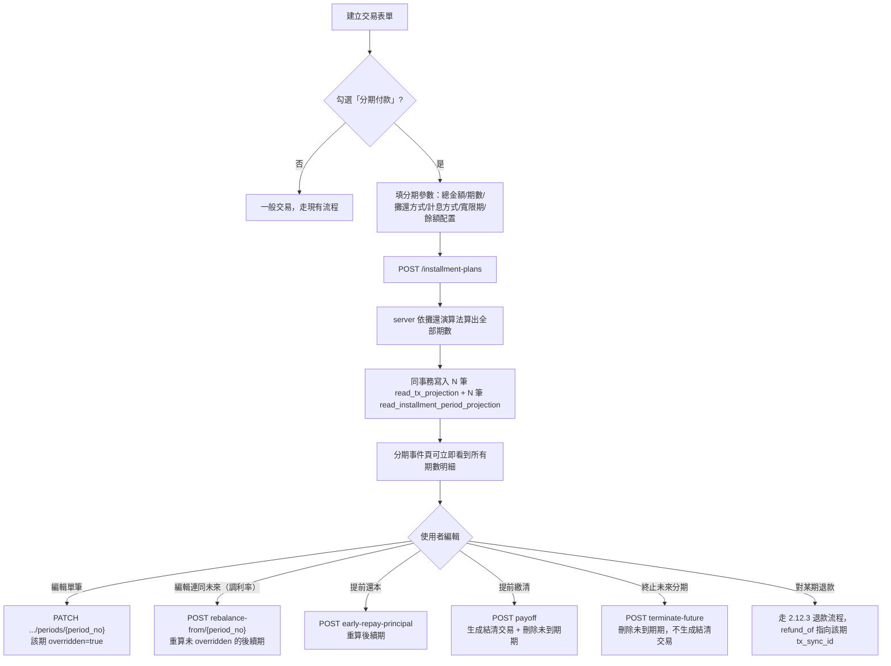
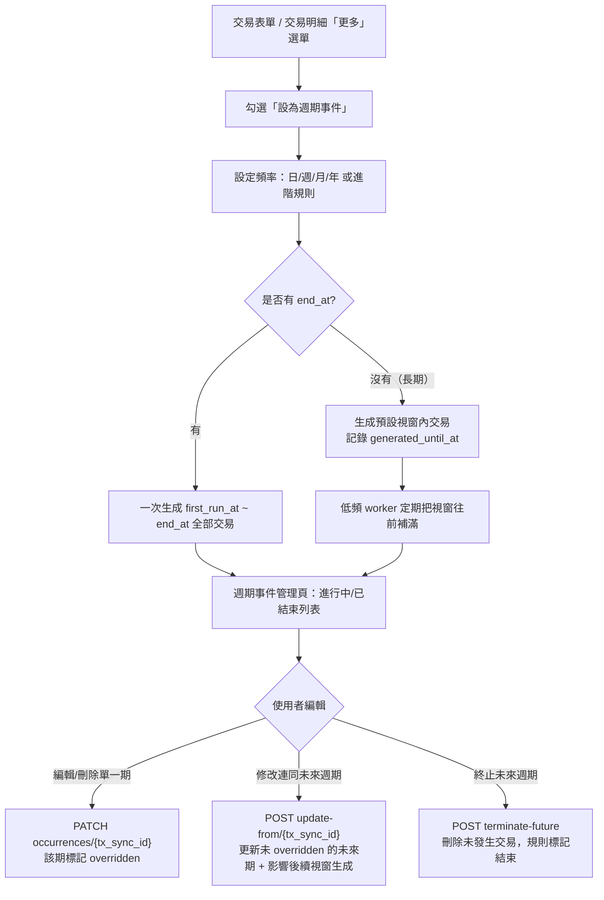
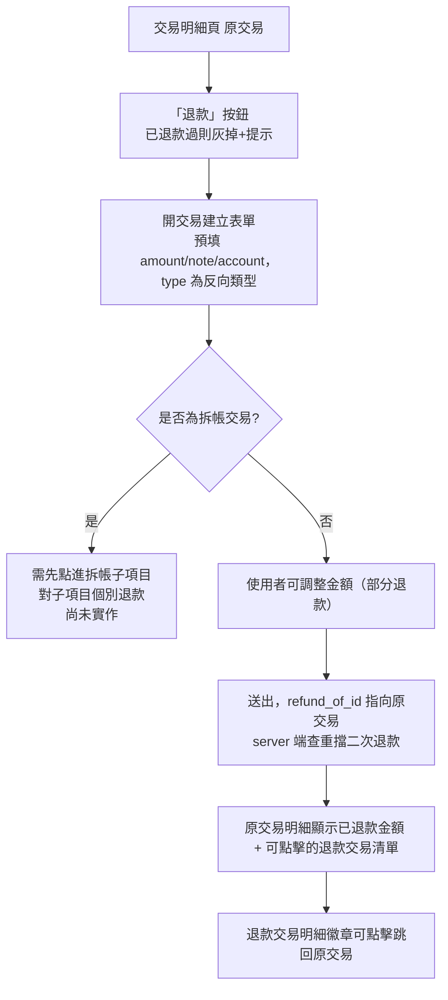

# Moze 功能對標 SD（差距分析與 server 端修改規格）

本文件盤點 [Moze 教學文件](https://doc.moze.app/)(索引見
[llms.txt](https://doc.moze.app/llms.txt))列出的功能項目，逐一對照
BeeCount Cloud 目前的實作範圍，列出**缺少的功能**、**建議的 server 端
修改內容**，以及跨端（mobile/web）需要配合的部分。

**範圍界定**：本倉庫是 server 端(FastAPI + SQLite/Postgres)。凡是純
iOS 系統整合類功能(Shortcuts App、Lock Screen Widgets、Apple Watch)
不需要 server 改動，只在文件末尾列出、標記「client-only」。真正需要
server 資料模型/API 變動的項目才會展開「修改內容」小節。

改動前請先讀 [SYNC_ARCHITECTURE.md](./SYNC_ARCHITECTURE.md)（新增 entity
的標準流程、LWW 契約、`_MERGE_SPECS` 登記法都在那）。下面每個新 entity
的「修改內容」都是照那份文件第 5 節「新增 entity」checklist 展開的。

---

## 1. 現況總覽表

對照 Moze 文件的 8 大分類，BeeCount 現況：

| Moze 分類 | 現況 |
|---|---|
| 帳戶設置 | ✅ 已支援(`accounts`：type/currency/初始餘額/note/信用額度/帳單日/繳款日/末四碼/隱藏) |
| 分類與專案 — 分類 | ✅ 已支援(`categories`：expense/income/transfer，含父子階層) |
| 分類與專案 — 專案/預算 | 🟡 部分(有 `budgets` 總額/分類預算，**沒有獨立「專案」概念**——§2.11 記帳模式依賴這個缺口，需要先決定要不要做真正的 project entity) |
| 記帳功能 | 🟡 部分(基本欄位、跨幣種、圖片/文字 AI 記帳已有；**退款 Phase 1.5 修正(§2.12.3)已完成，週期性/分期 Phase 1.5 修正(§2.12.1/§2.12.2)仍待開始；拆帳(§2.4)Phase 2 已完成(server+web)**；範本/語音記帳/記帳模式缺) |
| 信用卡管理 | 🟡 部分(帳戶已有信用卡欄位，**繳款/分期(分期本身已做通用版)/折抵/紅利/免息期建議全缺**) |
| 分析與對帳 | 🟡 部分(統計報表、淨值歷史已有；**比較報表、對帳模式(含延後入帳)、餘額調整缺**) |
| 同步與雲端 | ✅ 已支援(本倉庫就是這塊：登入/2FA/裝置管理/離線佇列/刪除帳號) |
| 捷徑功能 | ⚪ Client-only，server 不需改動 |
| 其他功能 | 🟡 部分(備份還原、搜尋、批次改刪、匯入匯出、**通知中心(Phase 0)**已有；台灣電子發票視市場決定要不要做) |

---

## 2. Gap 詳細清單（依建議優先順序）

### 2.1【基礎設施，建議最先做】通知中心 (Notification Center)

Moze: [feature/notification.md](https://doc.moze.app/feature/notification.md)

**現況**：`src/` 完全沒有 notification/reminder 相關 model 或 router。
後面「提醒入帳」「信用卡自動扣繳提醒」「預算超支提醒」都要靠這層，
建議第一個做，其它功能才有地方掛。

**修改內容**：
1. 新表 `notifications`（user-global，非 ledger-scoped）：
   `id, user_id, category(reminder/budget_alert/card_due/system), title,
   body, payload_json, read_at, created_at`
2. `alembic/versions/` 加 migration
3. `src/routers/notifications.py`（仿 `admin.py` 的獨立 router 風格，
   非 sync 實體，不進 `sync_changes`/projection，走一般 REST：
   `GET /notifications`、`POST /notifications/{id}/read`）
4. 產生通知的來源分散在各功能裡（budget 超支判斷、recurring 到期、
   信用卡繳款日前 N 天），不集中成一個 job，避免耦合
5. 是否要接 Web Push / APNs 由 mobile/web 端決定，server 端這層只負責
   落地一份「通知記錄」，跨端各自 poll 或收 WS 推播

---

### 2.2 週期性收支 (Recurring Transactions)

**✅ Phase 1 已實作(2026-07-30）**：`read_recurring_rule_projection` +
`src/routers/write/recurring_rules.py`(POST/PATCH/DELETE)+
`src/routers/read/ledgers.py` 的 `GET /ledgers/{id}/recurring-rules` +
`src/services/recurring_materializer.py`（asyncio 定時 loop,15 分鐘一次,
main.py 註冊；也可手動 `POST /internal/tasks/materialize-recurring` 立即
觸發）。到期生成交易時順帶寫 §2.1 notification。測試見
`tests/test_recurring_rules.py`。**web UI 已完成(2026-07-30）**：
`/app/recurring-rules`(`RecurringRulesPage` + `RecurringRulesPanel`），入口
在頭像下拉「工具」組，僅帳本 owner 可寫。mobile UI 仍待排期。

**⚠️ 2026-07-30 對照 Moze 原文更正**：以上實作的「排程 loop 逐期生成」
「獨立表單建規則」跟 Moze 真實設計（建立當下直接生成未來交易、掛在交易
建立流程上、編輯要區分單筆/連同未來）有落差，修正版設計見 §2.12.2，
下方原始 gap 分析內容予以保留供對照。

Moze: [record/recurring.md](https://doc.moze.app/record/recurring.md)

**現況**：完全沒有。`WriteTransactionCreateRequest` 只能建立單筆立即
發生的交易。

**修改內容**（照「新增 entity」六步）：
1. 新表 `read_recurring_rule_projection`：`sync_id, ledger_id, tx_type,
   amount, category_sync_id, account_sync_id, from/to_account_sync_id,
   note, frequency(daily/weekly/monthly/yearly), interval, next_run_at,
   end_at, enabled` + alembic migration
2. `src/projection.py` 加 `upsert_recurring_rule` / `delete_recurring_rule`
3. `src/sync_applier.py` 的 `_MERGE_SPECS` / `_UPSERT_DISPATCH` /
   `_DELETE_DISPATCH` 三張表登記 `recurring_rule`
4. `src/routers/write/recurring_rules.py`：POST/PATCH/DELETE
5. **排程執行**：新增 `src/services/recurring_materializer.py`，一個
   定時任務（複用現有 cron/背景任務機制，若無則需新增，比如 APScheduler
   或外部 cron 打一個 `/internal/tasks/materialize-recurring` 端點）掃
   `next_run_at <= now()` 的規則，各自產生一筆真正的 `sync_changes`
   交易（走跟 mobile push 相同的 `apply_change_to_projection`），並把
   `next_run_at` 推進到下一週期
6. 到期時順帶寫一條 §2.1 的 notification（"提醒入帳"對應的就是這裡）
7. pytest：一個 rule 到期 → 產生交易 → projection 可見；`next_run_at`
   正確推進；停用後不再產生

跨端：mobile/web 都要能建立/檢視/停用規則，並顯示「即將產生」清單。

---

### 2.3 分期付款 (Installment)

**✅ Phase 1 已實作(2026-07-30）**：`read_installment_plan_projection` +
`read_tx_projection.installment_plan_sync_id` 反查欄位 +
`src/routers/write/installment_plans.py`(POST 建計畫時同事務生成第一期
交易 / PATCH 可提前結清 / DELETE)+ `GET /ledgers/{id}/installment-plans`。
剩餘各期由 `src/services/recurring_materializer.py` 共用同一個排程 worker
按月推進(`add_months` 假設每期間隔一個月，跟信用卡帳單週期常見場景對齊；
未做免息期/折抵等信用卡專屬計算，那些排在 §2.9)。測試見
`tests/test_installment_plans.py`。**web UI 已完成(2026-07-30）**：
`/app/installment-plans`(`InstallmentPlansPage` + `InstallmentPlansPanel`），
建計畫後 total_amount/periods/first_period_at 不可改(對齊 server 約束),
只能提前結清或改備註。mobile UI 仍待排期。

**⚠️ 2026-07-30 對照 Moze 原文更正**：以上實作缺攤還演算法(本息均攤/
本金均攤/固定利息)、寬限期、餘額配置，且「僅生成第一期、其餘靠排程按月
推進」「獨立表單建計畫」跟 Moze 真實設計（建立交易當下就能設定分期、
當場算出全部期數、編輯要區分單筆/連同未來調息）有落差，修正版設計見
§2.12.1，下方原始 gap 分析內容予以保留供對照。

Moze: [record/installment.md](https://doc.moze.app/record/installment.md)、
信用卡的「[帳單分期](https://doc.moze.app/credit-card/statement-installment.md)」
是同一機制在信用卡場景的特化。

**現況**：完全沒有。一筆交易目前是原子的，沒有「拆成 N 期分別記一筆」
的概念。

**修改內容**：
1. 新表 `read_installment_plan_projection`：`sync_id, ledger_id,
   total_amount, periods, period_amount, first_period_at,
   account_sync_id(通常是信用卡), category_sync_id, note, status`
2. 子項：每期到期時實際生成一筆 `transactions`（`tx_type=expense`），
   並帶 `installment_plan_sync_id` 反查欄位 —— 這代表 `read_tx_projection`
   要加一個 nullable 欄位 `installment_plan_sync_id`（跟 §2.5 拆帳/退款
   的「反查欄位」模式一致，見下面 2.4/2.6 的共通設計筆記）
3. 產生時機：可以跟 §2.2 共用同一個排程 worker（installment 本質是
   固定期數的 recurring）
4. `src/routers/write/installment_plans.py`：POST(建立計畫，通常伴隨
   建立第一期交易)/PATCH(提前結清/修改期數)/DELETE
5. 信用卡場景的「免息期」計算(§2.9)要讀這裡的 `first_period_at` +
   account 的 `billing_day`/`payment_due_day`

---

### 2.4 拆帳 (Split a Transaction Across Multiple Categories)

**✅ Phase 2 server + web UI 已實作(2026-07-31）**：
`WriteTransactionCreateRequest/UpdateRequest.splits`（`WriteTxSplitItem`：
`category_id`/`category_name`/`amount`/`note`）；新表
`read_tx_split_projection`（`(ledger_id, tx_sync_id, sort_order)` 複合
PK，`projection.upsert_tx` 每次整批 delete-then-insert 重建，非獨立 sync
entity）；`read_tx_projection` 加 `has_splits`/`splits_json`
兩個欄位（`splits_json` 是 LWW merge fallback 的權威值,跟
`attachments_json` 同款模式,登記在 `sync_applier._LEDGER_MERGE_SPECS
["transaction"]`,沿用既有 partial-update 機制,沒有新增 entity_type）。
`has_splits=True` 時父行 `category_sync_id`/`category_name` 強制清空。
校驗（`write/_shared.py::_validate_tx_splits`）：tx_type 只能
expense/income、至少 2 筆、每筆金額 > 0、加總須等於交易 amount；且拆帳
交易不能整筆退款（`_assert_refund_target_has_no_splits`）、退款交易不能
同時是拆帳。`workspace_analytics` 展開 split 明細分別累加分類排行（按
整筆的 native/amount 折算比例縮放每筆 split 金額）；分類預算用量
（`GET /ledgers/{id}/budgets/usage`）額外從 `read_tx_split_projection`
查詢把 split 明細計入對應分類。web UI：`TransactionsPanel.tsx` 分類欄位
旁邊「拆分到多個分類」開關，開啟後可增刪多行「分類 + 金額」，即時顯示
「已分配 X / 總額 Y」；`TransactionDetailDialog.tsx` 顯示「拆分」徽章 +
分類明細多行，退款按鈕對拆帳交易灰掉；交易列表分類欄顯示拆帳交易的各
分類名拼接。測試見 `tests/test_tx_splits.py`（14 例）+
`frontend/apps/web/src/txSplitForms.test.ts`（11 例，純函數校驗邏輯）。
手動測試清單見 `docs/PH2_SPLIT_WEB_UI_MANUAL_TEST_PLAN.md`。

**尚未做**：拆帳子項目個別退款（Moze 原文支援，這次選擇直接擋整筆退款，
需要退款時用戶得先撤銷拆帳）、CSV 匯出的拆帳明細列、mobile 端本地
SQLite 子表（server 已經把 `splits` 塞進 sync payload,mobile 拉到會被
忽略,不會崩但看不到明細）、拆帳跟週期性收支/分期付款組合（`create_tx`
的 recurring 內聯創建路徑、`installment_plans.py` 生成各期交易的路徑都
沒有接 `splits` 參數，UI 層兩者互斥）。

Moze: [record/split-categories.md](https://doc.moze.app/record/split-categories.md)

---

### 2.5 借還款追蹤 (Payables / Receivables)

Moze: [record/payables-receivables.md](https://doc.moze.app/record/payables-receivables.md)

**現況**：有 `transfer` tx_type(帳戶互轉)，但沒有「欠某人 / 某人欠我」
這種跟**第三方(非自己帳戶)**的往來追蹤，也沒有「部分還款」狀態機。

**修改內容**：
1. 新表 `read_debt_projection`：`sync_id, ledger_id, direction
   (payable/receivable), counterparty_name, principal_amount,
   remaining_amount, due_at, status(open/partial/settled), note`
2. 每次還款/收款是一筆交易，帶反查欄位 `debt_sync_id`（同 §2.3/2.4
   的「反查欄位」模式），寫入時同步更新對應 debt 行的
   `remaining_amount`/`status`（跟 rename cascade 類似，需要在
   `apply_change_to_projection` 裡加一段 debt 餘額重算邏輯）
3. `src/routers/write/debts.py`：POST(建立欠款)/PATCH(改到期日/備註)/
   DELETE(僅允許 `remaining_amount == principal_amount` 時，即尚未還款)
4. 到期前提醒走 §2.1 notification

---

### 2.6 退款 (Refund)

**✅ Phase 1 已實作(2026-07-30）**：`read_tx_projection.refund_of_sync_id` +
`WriteTransactionCreateRequest/UpdateRequest.refund_of_id`。統計口徑淨額
在兩處生效:`read/_shared.py::_projection_totals`(`/summary` 與
`list_ledgers` 共用)以及 `read/workspace.py::workspace_analytics`(含
income/expense 總額、series、分類排行）。`balance` 口徑不受影響(退款方向
天然跟被退那筆的符號相反，數學上等價)。測試見 `tests/test_refund_stats.py`。

**✅ web UI 發起點已改為交易明細頁按鈕(2026-07-30，取代舊版「新建交易表單
下拉選退款對象」設計)**：交易明細彈窗(`TransactionDetailDialog.tsx`)右下
角「退款」按鈕，點擊後開「新建交易」表單並自動帶入原交易的
金額/備註/帳戶(分類留空讓使用者自己選，因為 expense/income 分類樹不互通)、
`refund_of_id` 指向原交易；交易詳情彈窗顯示「退款」徽章 + 反查「已退款
金額 + 退款交易清單」。

**✅ Phase 1.5 三項加強(2026-07-31）**：
1. **禁止重複退款**:一筆交易一旦已經被某筆退款交易引用過
   (`refund_of_sync_id` 指向它)，就不能再發起第二筆退款——server 端在
   `src/routers/write/_shared.py::_assert_refund_target_not_already_refunded`
   查重(create/update 兩條 fast path 都掛)，命中回 400
   `TX_ALREADY_REFUNDED`；web UI 對應把「退款」按鈕灰掉並用 `title`
   提示「這筆交易已經退過款」(`TransactionDetailDialog.tsx`)。**注意這
   跟 Moze 原文「支援對同一筆支出建立多筆退款(部分退款＋多次退款)」
   的設計不同**——BeeCount 這裡刻意選擇「一筆交易只能退一次」的簡化
   口徑(使用者需求明確要求)，未來如果要支援多次部分退款需要另外評估。
2. **雙向勾稽可點擊查詢**:退款交易的「退款」徽章可點擊跳轉回原交易；
   原交易「已退款金額」清單裡每一筆也可點擊跳轉到對應退款交易——用
   `GET /read/workspace/transactions?tx_sync_id=` 精確查單筆(不局限在
   當前已載入分頁)，同一個 detail 弹窗原地切換展示對象
   (`GlobalEntityDialogs.tsx::handleJumpToTx`)。
3. **income 也能被退款**:原本退款交易固定 `tx_type=income`(只能退
   expense)，現在退款交易的類型是被退那筆的反向類型——退 expense 用
   income 冲回來(不變)，退 income 改用 expense 冲回去。前端入口從
   `tx_type===expense` 放寬到 `expense || income`(仍排除 transfer)；
   統計口徑的 netting 邏輯(`_projection_totals` / `workspace_analytics`）
   對稱處理兩個方向：income 型退款冲抵 `expense_total`,expense 型退款
   冲抵 `income_total`。

**尚未做**的:CSV 匯出欄位、跨月退款回溯到原支出月份的口徑(目前退款淨額
算在退款自己發生的那個月/分類，不會回溯修正原支出那個月)、全量交易
搜尋 picker(目前退款發起走明細頁按鈕不需要搜尋 picker 了，此項僅影響
mobile UI 待排期部分)、拆帳(§2.4)子項目退款(依賴 §2.4 落地)、多次
部分退款(見上方「禁止重複退款」的取捨說明)。

Moze: [record/refund.md](https://doc.moze.app/record/refund.md)

---

### 2.7 範本 (Templates) / 範本記帳

Moze: [record/template.md](https://doc.moze.app/record/template.md)、
[shortcuts/template-entry.md](https://doc.moze.app/shortcuts/template-entry.md)

**現況**：沒有「存一組常用的 tx_type+amount+category+account 組合，
下次一鍵套用」的機制。

**修改內容**：
1. 新表 `read_tx_template_projection`：`sync_id, ledger_id, name,
   tx_type, amount, category_sync_id, account_sync_id, note, tag_sync_ids_json,
   sort_order`
2. `src/routers/write/tx_templates.py`：POST/PATCH/DELETE + 一個
   `POST /ledgers/{id}/tx-templates/{template_id}/apply` 端點，直接把
   範本內容套進一筆新交易(複用現有 `_commit_write` 交易建立邏輯)
3. 是新 entity 但寫入頻率低、無跨帳本共享/rename cascade 需求，是六步
   checklist 裡最簡單的一種

---

### 2.8 語音記帳 (Speech Entry)

Moze: [record/speech-entry.md](https://doc.moze.app/record/speech-entry.md)、
[shortcuts/speech-entry.md](https://doc.moze.app/shortcuts/speech-entry.md)

**現況**：`src/routers/ai/parse_tx_image.py` / `parse_tx_text.py` 已有
「圖片/文字 → 結構化交易」的 AI 解析管線，語音只差「語音轉文字」這一步
沒接。

**修改內容**（是現有管線的擴充，不是新概念）：
1. `src/routers/ai/parse_tx_speech.py`：接收音檔(或 mobile 端先轉好的
   文字，看要不要 server 側跑 STT)，複用 `parse_tx_text.py` 現有的
   「文字 → 交易 JSON」prompt/parsing 邏輯
2. 若 server 端要跑語音轉文字，需在 `src/services/ai/` 新增 provider
   (對照 `test_provider.py` 現有的 provider 測試模式)
3. 大部分工程量在 mobile 端(錄音 UI + 上傳)，server 端改動相對小

---

### 2.9 信用卡管理整組功能

Moze 分類：[credit-card/*](https://doc.moze.app/credit-card/statement-combined.md)

**現況**：`accounts` 表已經有 `credit_limit`/`billing_day`/
`payment_due_day`/`bank_name`/`card_last_four`，但這些欄位目前只是
「存起來顯示」，沒有任何計算或工作流程邏輯掛在上面。

逐項：

| 子功能 | 現況 | 修改內容 |
|---|---|---|
| 主帳戶(合併帳單) | 缺 | 帳戶需要一個 `parent_account_id`(自我參照)把附卡/子卡掛在主卡下；讀路徑合併計算帳單 |
| 信用卡繳款 | 部分(可用 transfer 手動記) | 加一個「繳款」語意化端點 `POST /accounts/{id}/card-payment`，本質是產生一筆 transfer，但額外做「衝抵當期應繳金額」的計算與標記 |
| 自動扣繳 | 缺 | 依賴 §2.2 recurring 機制：一條 `frequency=monthly` 的 recurring rule，`next_run_at` 算法要對齊 `payment_due_day` |
| 帳單分期 | 缺 | 就是 §2.3 installment，`account_sync_id` 指向信用卡即可，不需要獨立資料結構 |
| 帳單折抵 | 缺 | 需要「折抵券/回饋金餘額」概念，見下一行紅利回饋，折抵是紅利餘額的一種消費 |
| 免息期推薦 | 缺，但資料都在(billing_day/payment_due_day) | 純計算端點，不需新表：`GET /accounts/{id}/interest-free-suggestion`，用 `billing_day`+`payment_due_day` 算「這個月哪天前買，下次繳款日最遠」 |
| 紅利回饋 | 缺 | 新表 `read_card_rewards_projection`：`account_sync_id, balance, rule_note`；每筆信用卡交易產生時按規則(可先手動輸入回饋比例)累加，這塊業務規則因發卡行而異，建議先做「手動記錄回饋金額」的簡化版，不做自動比例計算 |

信用卡這組建議整體排在 §2.2~§2.7 之後，因為「免息期建議」「自動扣繳」
都依賴 recurring/installment 先落地。

---

### 2.10 分析與對帳（含「延後入帳」——必做）

| 子功能 | 現況 | 修改內容 |
|---|---|---|
| 統計報表 | ✅ `workspace_analytics` / `summary.py` 已覆蓋大部分 | 若要對齊 Moze 的[statistics-report.md](https://doc.moze.app/analysis/statistics-report.md) 細節維度(如按 tag 交叉分析)，屬於既有端點加參數，不需新架構 |
| 比較報表 | 🟡 只有 `net-worth-history`，沒有「本月 vs 上月/去年同期」結構化比較 | 新端點 `GET /workspace/comparison?period=month&offset=1`，複用 `workspace_analytics` 的聚合邏輯跑兩個區間再算 diff，不需新表 |
| 對帳模式 | 缺 | 新表 `read_reconciliation_projection`：`account_sync_id, statement_date, statement_balance, reconciled_at`；核心邏輯是比對 `statement_balance` vs 該帳戶截至該日的交易加總，差額提示使用者去補交易或走下一項「餘額調整」 |
| **延後入帳** | 缺 | 見下方獨立小節 —— 這是對帳模式能不能對得準的關鍵前提，**必做**，不是可選項 |
| 餘額調整 | 缺 | 交易層面加一個 `tx_type=adjustment`(目前 Literal 只有 expense/income/transfer)，語意是「直接把帳戶餘額修正到指定值」，差額系統自動算出寫成一筆特殊交易；`snapshot_mutator.py` 幾處 `tx_type not in {"expense","income","transfer"}` 的白名單檢查都要加上 `adjustment` |

#### 延後入帳 (Deferred Posting) —— 對帳模式的必要子功能

Moze: [record/postpone.md](https://doc.moze.app/record/postpone.md)

**這不是 client-only 的草稿狀態**，重新讀了原文後更正：這是在**信用卡
對帳流程**中使用的功能 —— 信用卡消費日跟銀行實際請款日常常有時間差
（店家批次彙整消費後才跟銀行請款），對帳時如果某筆交易還沒出現在當期
帳單，使用者就把該筆交易標記「延後入帳」並填入實際入帳日，系統對帳時
「自動略過尚未入帳的交易」，避免帳單對不上。這個標記跟日期**必須跟交易
一起同步到其他裝置**(不然在別的裝置對帳會看到不一致的結果)，所以是
`read_tx_projection` 的正式欄位，不是本地暫存。因此**移出「client-only」
分類，列為對帳模式的必做前置項**：

**修改內容**：
1. `ReadTxProjection` 加 nullable 欄位 `deferred_posting_at: datetime`
   （有值 = 該筆交易處於「延後入帳」狀態，值是使用者填的實際入帳日；
   `None` = 正常，維持現行行為）
2. `WriteTransactionCreateRequest` / `Update` 加對應欄位
   `deferred_posting_at: datetime | None`
3. §2.10「對帳模式」比對邏輯：計算某帳戶「這期帳單應含哪些交易」時，
   排序/篩選鍵改用 `COALESCE(deferred_posting_at, happened_at)`，
   而不是單純 `happened_at`；也就是延後入帳的交易會被歸到
   `deferred_posting_at` 那一期帳單，而不是原本記錄的那一期
4. 統計報表(§2.10 統計報表列、`workspace_analytics`)若也要看「入帳日」
   口徑(而非「消費日」口徑)，同一個 `COALESCE` 邏輯要複用，避免兩處
   算法各寫一套导致對不上
5. §2.9 信用卡「主帳戶(合併帳單)」的帳單彙總也要套用同一個
   `COALESCE` 規則，三處(對帳/統計/信用卡帳單彙總)共用同一個 helper
   函式，不要各自實作一份

---

### 2.11 記帳模式 (Entry Mode Profiles)

Moze: [record/entry-mode.md](https://doc.moze.app/record/entry-mode.md)

**重新讀過原文後更正**：這不是單純的 UI 呈現方式，而是「使用者依情境
(日常/旅遊/工作/娛樂…)自訂一組**預設值 + 過濾規則**，記帳時套用」的
功能，具體是：

- 建立模式時可指定：預設幣種、預設帳戶、預設專案、預設類別範圍
- 套用某個模式後，記帳表單的類別/帳戶/專案頁籤會**過濾掉跟這個情境
  無關的選項**（例如「旅遊模式」只顯示旅遊相關類別跟外幣帳戶）
- 首頁長按＋號可快速切換目前使用的模式
- 這些「模式定義」是使用者設定，**必須跨裝置一致**(不然手機建的旅遊
  模式，換平板記帳就看不到)，所以定義本身要跟其它 entity 一樣走同步，
  不是單裝置本地設定

**現況**：完全沒有這個概念，也沒有「模式」對應的 entity。

**重要依賴**：Moze 的模式定義裡包含「預設專案」，但 BeeCount 目前
**沒有獨立的「專案」entity**（見 §1 總覽表，`budgets` 只有
total/category 兩種類型，沒有 project 類型）。要嘛先做一個真正的
`project` entity(範圍比本文件其它項目大，等於要再過一次 Moze
[prepare/project.md](https://doc.moze.app/prepare/project.md) 那組
文件才能定案)，要嘛 v1 先用現有的 `tags` 頂替「專案」語意(風險：
tag 目前是多對多、無層級、無預算掛勾，跟 Moze 的「專案」語意不完全
等價，只能算暫代方案)。這個依賴沒解掉之前，模式定義只能先做
幣種/帳戶/類別三項過濾，專案過濾留空。

**修改內容**：
1. 新表 `read_entry_mode_profile_projection`：`sync_id, ledger_id, name,
   default_currency, default_account_sync_id, default_project_id(待
   project entity 定案前先留空/null), category_filter_json(允許的
   category_sync_id 陣列，空陣列=不過濾), sort_order`
2. `src/projection.py` 加 `upsert_entry_mode_profile` /
   `delete_entry_mode_profile`
3. `src/sync_applier.py` 三張表(`_MERGE_SPECS`/`_UPSERT_DISPATCH`/
   `_DELETE_DISPATCH`)登記 `entry_mode_profile`
4. `src/routers/write/entry_mode_profiles.py`：POST/PATCH/DELETE
5. 「目前使用中的模式」這個選取狀態**不需要 server 儲存**(純 UI 狀態，
   可以是本地 per-device，也可以是簡單塞進 §... 現有的
   `UserProfile`/`Device` 表加一個 `active_entry_mode_sync_id` 欄位，
   看 mobile/web 需不需要跨裝置記住上次選的模式再決定要不要做這步)
6. 這個功能大部分工作量在 mobile/web 的記帳表單過濾邏輯(跟
   `../BeeCount/CLAUDE.md` 的 mobile 契約一起排期)，server 端只負責
   把模式定義存好、同步好

---

### 2.12 Phase 1.5：週期性收支／分期付款／退款 設計修正

**背景**：2026-07-30 使用者對照 Moze 官方文件
（[record/installment](https://doc.moze.app/record/installment)、
[record/recurring](https://doc.moze.app/record/recurring)、
[record/refund](https://doc.moze.app/record/refund)）重新檢視後發現，
§2.2/§2.3/§2.6 的 Phase 1 實作跟 Moze 的真實設計有三個系統性落差，需要
在下一輪迭代（Phase 1.5）修正：

1. **分期付款、週期性收支都應該在「建立當下」直接生成所有（或一大段）
   未來交易，不是靠背景排程逐期推進**。目前 `recurring_materializer.py`
   「每 15 分鐘掃一次 `next_run_at`」的模式，跟 Moze「一鍵建立、後續
   日期直接看到對應記錄」的體感不一致（使用者建完週期規則後要等最多
   15 分鐘、每次只多一期，才會看到下一筆），也讓「修改連同未來」這種
   批次編輯操作在還沒生成的期數上無從下手。
2. **兩者都需要支援「編輯單筆 vs 編輯整批（連同未來）」的差異化語意**，
   不是現有的一個 PATCH 端點打平所有欄位。
3. **退款的發起點應該在原支出交易的明細頁（右上角選單「退款」）**，
   點擊後開的新交易表單要自動帶入原支出的金額/備註等資料，而不是像
   現在這樣在「新建交易」表單裡從下拉選單挑一筆既有交易關聯（且需要
   手動填全部欄位）。

以下逐項列出修正後的規格，附流程圖供審閱（Moze 原文部分細節未載明的地方
已標注為「待決策項」，需要產品面拍板）。

#### 2.12.1 分期付款（修正版）

**Moze 真實設計**（見 [record/installment](https://doc.moze.app/record/installment)）：
- 建立時機：在**建立交易的當下**勾選「分期」，同一個表單設定分期參數，
  不是先建一個獨立的「分期計畫」再回頭補第一筆交易
- 可設定參數：總金額、期數、每期金額、金額是否取整、餘額（除不盡的
  零頭）納入首期或末期
- 利率類型三選一：本息均攤／本金均攤／固定利息；計息方式：按月／按日
- 特殊參數：寬限期（設定 N 個月「只繳息不還本」）
- 建立後：系統**當場算出所有期數的本金/利息明細**並讓使用者在「分期
  事件」頁查看，之後每期到期會自動出現在帳本
- 編輯時區分：
  - 編輯單筆：只改該期金額/日期/備註，可選是否連動重算剩餘本金
  - 編輯連同未來（利率調整）：從指定期數起套用新利率，系統自動重算
    後續所有期數
  - 提前還本（部分還款）：減少本金，重算後續期數與利息
  - 提前繳清：一次算出剩餘本金+當期利息，移除尚未到期的未來期數
  - 終止未來分期：直接砍掉未產生的未來期數，不強制當下額外還款
  - 分期退款：對某一期或全部期數做退款（複用退款機制）

**跟現有 Phase 1 實作的落差**：
- 現況入口是獨立的「建立分期計畫」表單（`InstallmentPlansPanel`），
  不是掛在交易建立流程上
- 現況只在 POST 當下生成**第一期**交易，其餘期數靠
  `recurring_materializer.py` 每 15 分鐘按月推進一期（`add_months`），
  使用者要等排程才看得到後續期數
- 現況沒有本息均攤/本金均攤/固定利息三種攤還演算法，也沒有寬限期、
  餘額配置(首期/末期)、金額取整這些參數
- 現況 PATCH 只能「提前結清」或改備註，沒有「編輯單筆」「編輯連同
  未來（利率調整）」的差異化語意

**修改內容**：
1. `read_installment_plan_projection` 加欄位：
   `repayment_method`(equal_installment/equal_principal/fixed_interest)、
   `interest_period`(monthly/daily)、`interest_rate`、
   `round_amounts`(bool)、`remainder_position`(first/last)、
   `grace_period_months`(int, default 0)
2. 新表 `read_installment_period_projection`：`sync_id, plan_sync_id,
   ledger_id, period_no, due_at, principal_amount, interest_amount,
   total_amount, status(pending/generated/overridden/refunded),
   tx_sync_id`（每期一行，`tx_sync_id` 指回實際生成的那筆
   `read_tx_projection`）
3. `POST /ledgers/{id}/installment-plans`：建立時依攤還演算法**一次
   算出全部期數**，同一個 sync 事務內為每期各寫一筆
   `read_tx_projection`（`installment_plan_sync_id` 反查欄位延續現有
   設計）+ 一筆 `read_installment_period_projection`；不再依賴
   `recurring_materializer` 逐期生成分期交易（該檔案裡屬於 installment
   的推進邏輯可以整段移除，僅保留 recurring 相關部分，見 2.12.2）
4. 新端點支援差異化編輯：
   - `PATCH /ledgers/{id}/installment-plans/{plan_id}/periods/{period_no}`：
     編輯單筆（金額/日期/備註），`overridden=true`，之後整批重算會
     跳過這期
   - `POST /ledgers/{id}/installment-plans/{plan_id}/rebalance-from/{period_no}`：
     帶新利率，從該期起依攤還演算法重算並覆蓋後續未 `overridden` 的期數
   - `POST /ledgers/{id}/installment-plans/{plan_id}/early-repay-principal`：
     部分還本，重算後續期數
   - `POST /ledgers/{id}/installment-plans/{plan_id}/payoff`：提前結清，
     算出剩餘本金+當期利息生成一筆結清交易，刪除未到期的未來期
     `read_tx_projection`
   - `POST /ledgers/{id}/installment-plans/{plan_id}/terminate-future`：
     直接刪除未到期的未來期交易，不生成結清交易
   - 分期退款直接複用 §2.6 修正版的退款機制（見 §2.12.3），退款目標
     指向某期的 `tx_sync_id`
5. 攤還演算法（本息均攤/本金均攤/固定利息 × 按月/按日 × 寬限期）建議
   抽成 `src/services/installment_amortization.py` 純函式，方便寫單元
   測試鎖定精度（分期最容易出的 bug 是尾差/四捨五入，`remainder_position`
   參數就是處理這個）
6. pytest：三種攤還方式的本金/利息明細正確；`overridden` 期數在
   rebalance 時被跳過；payoff/terminate-future 正確刪除未來期且保留
   已發生期



#### 2.12.2 週期性收支（修正版）

**Moze 真實設計**（見 [record/recurring](https://doc.moze.app/record/recurring)）：
- 建立時機：從一筆交易的「更多」選單勾選「設為週期事件」，不是獨立
  表單先建規則
- 頻率：日/週/月/年，並支援進階規則（如「每週六日」「每月 10 號」）
- 建立後即可在對應的未來日期看到交易，不需要額外操作
- 管理頁面列出「進行中」和「已結束」的週期事件，左滑編輯/刪除
- 編輯時區分：
  - 單獨編輯/刪除某一期
  - 修改連同未來週期：從某期起套用新內容
  - 終止未來週期：把尚未發生的未來期一次刪除，規則標記結束

**跟現有 Phase 1 實作的落差**：
- 現況入口是獨立的「新增週期規則」表單（`RecurringRulesPanel`），不是
  掛在交易建立/交易明細流程上
- 現況靠 `recurring_materializer.py` 排程（15 分鐘一次）掃
  `next_run_at` 逐筆生成，使用者建完規則後不會立即在未來日期看到交易，
  且「未來一段時間內會產生哪些交易」在生成之前無法預覽或批次編輯
- 現況 PATCH 只能改規則本身欄位（金額/分類/頻率等），沒有「這期以後」
  跟「只改這一筆」的差異化語意，也沒有反查欄位讓已生成的交易知道自己
  屬於哪個規則版本

**待決策項**（Moze 原文未載明，需要產品面拍板）：文件沒說「預先產生到
多久之後」。日/週頻率如果無限期預先產生會炸資料量。建議：
- 若使用者有設定 `end_at` → 建立當下一次把 `[first_run_at, end_at]`
  全部生成
- 若沒有 `end_at`（長期規則）→ 建立當下先生成一個預設視窗（例如未來
  12 個月，或最多 200 筆，取先到者），規則加 `generated_until_at`
  欄位記錄「已生成到哪個時間點」；`recurring_materializer.py` 保留
  一個低頻（例如每天一次而非每 15 分鐘）的「續產生」loop，只負責把
  `generated_until_at` 往前推進一段（例如再補未來 12 個月），語意從
  「到期才生成」改成「保持未來視窗被填滿」
- 這個視窗策略要跟前端討論 UX（例如管理頁怎麼呈現「已生成 vs 尚未
  生成」的分界）

**修改內容**：
1. `read_recurring_rule_projection` 加欄位：`generated_until_at`
   (datetime)、`advanced_rule_json`(存「每週六日」「每月10號」這類
   進階規則，簡單 frequency+interval 不夠表達時使用)
2. 建立交易時若帶 `recurring: {...}` 參數，`POST /ledgers/{id}/
   transactions` 這條既有路徑直接建規則 + 依上面的視窗策略批次生成
   未來交易（複用交易建立本體的邏輯，而不是要求前端先呼叫
   recurring-rules 端點再呼叫交易端點）；獨立的 `POST /ledgers/{id}/
   recurring-rules` 端點保留給「事後把已存在的交易設為週期起點」的情境
3. 每筆生成的交易延續現有 `installment_plan_sync_id` 的反查欄位模式，
   加 `recurring_rule_sync_id`（若現有欄位命名不同需對齊）
4. 新端點支援差異化編輯：
   - `PATCH /ledgers/{id}/recurring-rules/{rule_id}/occurrences/{tx_sync_id}`：
     單獨編輯/刪除某一期（本質是編輯/刪除那筆 `read_tx_projection`，但
     要標記「不要被下面的整批更新覆蓋」，比照 §2.12.1 的 `overridden`）
   - `POST /ledgers/{id}/recurring-rules/{rule_id}/update-from/{tx_sync_id}`：
     帶新內容，更新該期以後所有「未 overridden」的已生成交易，並讓
     後續視窗內新生成的交易也套用新規則版本
   - `POST /ledgers/{id}/recurring-rules/{rule_id}/terminate-future`：
     刪除所有未發生（`happened_at > now()`）的已生成交易，規則標記
     `enabled=false`
5. `recurring_materializer.py` 重構：拆成「視窗續產生」（recurring
   專用，低頻）和「分期期數推進」（§2.12.1 已改成建立當下一次生成，
   這部分邏輯整段刪除）兩塊，不要共用同一個 loop 語意
6. pytest：視窗生成範圍正確；`update-from` 只影響未 overridden 的未來
   期；`terminate-future` 只刪未發生的交易，已發生的保留；
   `generated_until_at` 正確推進



#### 2.12.3 退款（修正版，✅ web 已落地 2026-07-30/31，mobile 待排期）

**Moze 真實設計**（見 [record/refund](https://doc.moze.app/record/refund)）：
- 發起點：點開**原支出交易的明細**，右上角選單選「退款」
- 開啟的退款表單：自動帶入原支出的金額/備註等資料（可修改，支援部分
  退款）；退款帳戶預設同原支付帳戶，但可指定不同帳戶
- 原交易明細上會顯示「已退款」的金額資訊，可以點進去查看對應的退款
  交易
- 支援對同一筆支出建立多筆退款（部分退款＋多次退款）
- 多分類（拆帳，§2.4）交易不能整筆退款，要對拆帳子項目個別退款

**BeeCount web 現況(對照 Moze 逐項)**：
- ✅ 發起點：交易明細彈窗（`TransactionDetailDialog.tsx`）「退款」按鈕，
  取代舊版「新建交易表單下拉選退款對象」
- ✅ 自動帶入原交易金額/備註/帳戶（分類故意留空，見 §2.6）；金額可改
  （支援部分退款）
- ✅ 原交易明細顯示「已退款金額」+ 退款交易清單，**且可點擊查看對應的
  退款交易**（雙向勾稽，見 §2.6 Phase 1.5 項 2）——比 Moze 原文描述的
  單向「可以點進去查看」更完整，退款交易本身也能點徽章跳回原交易
- ⚠️ **刻意不做**「支援對同一筆支出建立多筆退款」：BeeCount 選擇「一筆
  交易只能被退一次」的簡化口徑（§2.6 Phase 1.5 項 1，使用者需求明確
  要求），這是跟 Moze 原文的既知差異，不是尚待實作的落差
- ✅ income 也能被退款（原本只有 expense，§2.6 Phase 1.5 項 3；Moze 原文
  沒有明確提這點，算 BeeCount 自己的擴充）
- ❌ 拆帳（§2.4）子項目個別退款：依賴 §2.4 落地，見下方修改內容第 4 點
  （原樣保留，尚未實作）
- ❌ 退款帳戶預設同原支付帳戶但可指定不同帳戶：現況帳戶欄位是空的普通
  帳戶選擇器，沒有「預設同原帳戶」的自動帶入邏輯（小落差，未修）

**剩餘修改內容**（拆帳子項目退款，依賴 §2.4）：
1. 拆帳（§2.4）子項目退款依賴 §2.4 落地後才能做，先在 §2.4 的修改
   內容加一行備註：`read_tx_split_projection` 也要能被
   `refund_of_sync_id` 指到（而不是只有父交易）



---

需要跟前端（web + mobile）一起排期，因為這次修正的核心是「建立時機」跟
「發起入口」都要搬到交易建立/交易明細流程裡，不是獨立表單能解決的；
server 端排程 worker（`recurring_materializer.py`）的語意也要跟著改
（從「逐期生成」改成「視窗續產生」），這塊改完要重新過一次 §2.2/§2.3
既有的 pytest，確認舊測試的假設（例如「一次只生成一期」）要更新或刪除。

---

## 3. Client-only，本倉庫不需要動的項目

以下是 Moze 文件裡的功能，但屬於 iOS 系統整合層，跟 server 端資料模型
無關，若要做也是在 `../BeeCount` (mobile) 那個倉庫：

- [捷徑功能整組](https://doc.moze.app/shortcuts/download.md)(iOS Shortcuts App)
  —— 概念上最接近的是本倉庫已有的 `src/mcp/`（給 AI agent 呼叫的工具
  介面），若要支援 iOS Shortcuts，等於是幫 mobile 端暴露幾個輕量寫入
  端點，端點本身多半已存在(`/write/ledgers/{id}/transactions` 等)
- [Lock Screen Widgets](https://doc.moze.app/feature/lock-screen-widgets.md)
- [Widget 小工具](https://doc.moze.app/feature/widget.md) —— 若既有的
  `/summary` 回應太重，可以考慮加一個輕量 `GET /widget-summary` 端點，
  但這是「效能優化」而非「新功能」，先確認 mobile 端實測需求再做
- [Apple Watch](https://doc.moze.app/feature/apple-watch.md)

> 原本這裡也列了「記帳模式」和「延後入帳」，重新看過原文後兩者都需要
> server 端資料支援，已移到 §2.10 / §2.11 展開，不再算 client-only。

**視市場決定，暫不建議做**：

- [台灣電子發票](https://doc.moze.app/feature/invoice.md) —— 需串接
  財政部電子發票平台 API，是台灣在地法規功能，跟記帳核心邏輯無關，
  建議等有台灣市場需求時再獨立立項

---

## 4. 建議實作順序

```
Phase 0(地基）: §2.1 通知中心 ✅ server + web UI 已完成(2026-07-30);mobile UI 待排期
Phase 1(核心記帳擴充）: §2.2 週期性收支 → §2.3 分期付款 → §2.6 退款(輕量，可插隊)
                        ✅ server + web UI 已完成(2026-07-30);mobile UI 待排期
Phase 1.5(設計修正，對照 Moze 原文重新對齊）: §2.12 週期性收支/分期付款
                        建立時機改成「建立當下直接生成」、編輯語意加上
                        單筆/連同未來區分、退款發起入口搬到原交易明細
                        §2.12.3 退款部分 ✅ 已完成(2026-07-30/31)；
                        §2.12.1 分期付款、§2.12.2 週期性收支的建立時機/
                        差異化編輯修正 🔴 仍未開始
Phase 2(統計口徑動刀，建議獨立 PR）: §2.4 拆帳
                        ✅ server + web UI 已完成(2026-07-31)；先於
                        Phase 1.5 剩餘部分(§2.12.1/§2.12.2)落地，因為
                        使用者這次直接指定先做 §2.4；跟拆帳互動的邊界
                        (splits + recurring/installment 組合)已在
                        write 層跟前端 UI 擋住，等 §2.12.1/§2.12.2 真的
                        落地時要重新檢視這個互斥要不要放開
Phase 3(往來/範本，彼此獨立可並行）: §2.5 借還款追蹤、§2.7 範本
Phase 4(信用卡整組，依賴 Phase 1 的 recurring/installment）: §2.9
Phase 5(分析對帳，必做）: 延後入帳(必做前置) → §2.10 對帳模式/餘額調整 → 比較報表(輕)
Phase 6(AI 擴充，跟前面無依賴，可隨時插入）: §2.8 語音記帳
Phase 7(依賴專案 entity 決策，排期最晚）: §2.11 記帳模式
```

每個 Phase 落地時記得照 CLAUDE.md 的檢查表：
`alembic migration` + `projection.py` + `sync_applier.py` 三張登記表
+ write endpoint + read endpoint + `test_projection_consistency.py`
風格的 merge 契約測試 + 多帳本 dedup 測試。拆帳(§2.4)、退款(§2.6)、
延後入帳/餘額調整(§2.10)三項會動到既有統計聚合邏輯，改動時要跑一次
`pytest tests/` 全量回歸，確認舊有統計數字沒被新欄位影響。

Phase 7 排最晚是因為 §2.11 記帳模式明確依賴「專案」這個目前不存在的
entity —— 開始做之前要先跟產品面確認：專案是要做成正式 entity(工程量
比照 §2.2~§2.7 任一項)，還是拿現有 `tags` 暫代(工程量小很多但語意
不完全對)。這個決策沒定案，§2.11 沒辦法排進 sprint。
