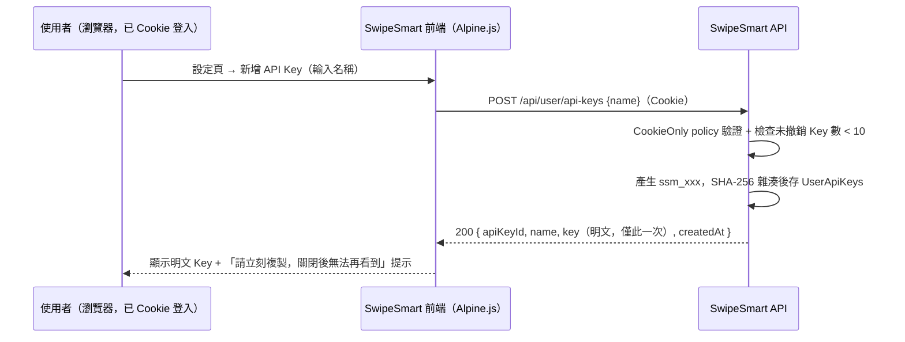
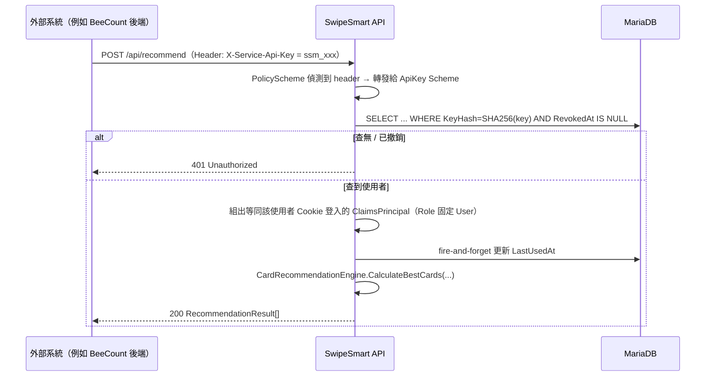
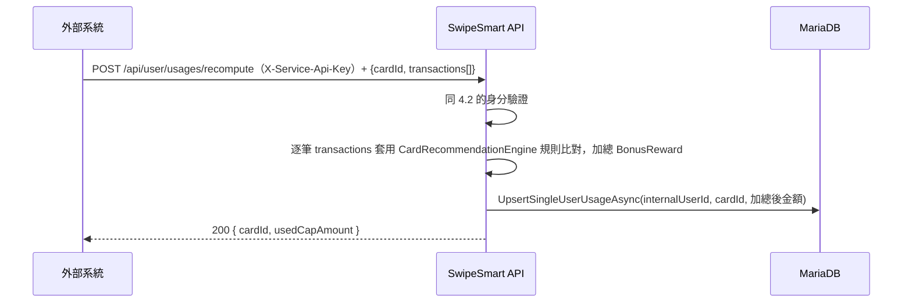

# SwipeSmart 個人 API Key（Personal Access Token）SD

本文件是 SwipeSmart2 為了讓「外部系統代表使用者呼叫」而需要新增的身分驗證
機制的設計文件（SD）。對應 `docs/PH14_SWIPESMART_CARD_RECOMMEND_SD.md`
（BeeCount 那邊寫的整合 SD）§3.2 Path B 列給 SwipeSmart 的需求——該文件明
確說這部分「需要另外排入 SwipeSmart2 自己的開發排程，不在 BeeCount 改動範
圍內」，本文件就是那個排程的設計產出。

**本文件不包含任何程式改動**，只做設計与現況調查，實作留待這份 SD 確認後
再分段進行。

---

## 0. 背景與目標

目前 SwipeSmart2 唯一的認證方式是 OIDC（Synology SSO）+ Cookie Session，
是瀏覽器互動式登入專用的設計，沒有任何 service-to-service 或「代表使用者
呼叫」的管道。BeeCount（另一個獨立部署的記帳系統）想要在使用者記帳時即時
呼叫 SwipeSmart 的 `POST /api/recommend` 取得刷卡建議，並把使用者的當期消
費金額回填進 SwipeSmart 的使用額度紀錄——這兩件事都需要 BeeCount 後端能
夠「以某個 SwipeSmart 使用者的身分」呼叫 API，而不只是匿名或全域服務金
鑰（原因見 PH14 §3.2 開頭：`/api/user/usages` 本來就是綁定 `InternalUserId`
的個人資料，寫入語意上就需要代表特定使用者）。

目標：新增「個人 API Key」機制（比照 GitHub PAT 的使用體驗），讓 SwipeSmart
使用者可以在自己的設定頁產生一把綁定自己身分的 Key，貼給外部系統（目前是
BeeCount，但設計上不綁死特定呼叫方）使用，同時：

- 不影響現有 OIDC + Cookie 的瀏覽器登入流程與既有前端。
- Admin 維護端點（卡片/規則庫的 POST/PUT/DELETE）維持 Cookie-only，即使
  某把 Key 屬於 Admin 帳號，也不能用 Key 做管理操作（PH14 §3.2 Path B 第
  3 點的明確要求）。
- 呼應 PH14 §3.2 Path B 第 5 點「待確認」：`/api/user/usages` 的寫入語意
  是 `UsedCapAmount`（回饋上限已用掉的金額），外部呼叫方能算出來的只有
  「消費金額」，兩者不是同一個數字——本文件 §3.4 給出具體解法。

---

## 1. 現況調查（本次修改直接相關的部分）

以下皆為目前 `main` 分支實際程式碼（非 README 描述，README 的「SQLite」
已過時，實際已改用 MariaDB）：

### 1.1 認證與授權設定（`src/CardStrategy.Api/Program.cs:83-230`）

- `AddAuthentication` 預設 Scheme 是 Cookie，`DefaultChallengeScheme` 是
  OIDC（`Program.cs:83-87`）。
- `AddCookie`（`:88-110`）：1 小時 idle timeout、`SlidingExpiration`，未登
  入打 `/api/*` 回 401（不是導向登入頁）。
- `AddOpenIdConnect`（`:111-224`）的 `OnTokenValidated` 事件：登入成功後
  把 SSO 使用者同步進 `Users` 表（不存在就 `CreateUserAsync`），並把
  `InternalUserId`、DB 裡的 `Role` 塞進 Claims（`:191-203`）。這是目前唯
  一「使用者身分」的建立管道。
- 只有一個 Authorization Policy：`AdminPolicy`（`:228-229`，
  `RequireRole("Admin", "Administrator")`），**沒有限定 AuthenticationScheme**
  ——這點對本次設計很關鍵，見 §3.3。
- 各端點目前一律用 `.RequireAuthorization()`（任意登入者）或
  `.RequireAuthorization("AdminPolicy")`（僅管理員），沒有第三種「這個端
  點只能用 Cookie，不能用其他 Scheme」的既有寫法可以直接照抄，本次要新增
  這個能力（§3.3）。

### 1.2 使用者/Repository（`IUserRepository`、`MariaDbUserRepository`）

- `IUserRepository`（`src/CardStrategy.Core/Interfaces/IUserRepository.cs`）
  目前只有以 `SsoSubId` 或 `InternalUserId` 存取的方法，沒有任何跟「憑證/
  金鑰」相關的方法。
- `MariaDbUserRepository.InitializeDatabase()`
  （`src/CardStrategy.Core/Services/MariaDbUserRepository.cs:29-82`）用
  `CREATE TABLE IF NOT EXISTS` 起 4 張表（`Users`/`UserFavorites`/
  `UserUsages`/`UserCards`），並用「查 `INFORMATION_SCHEMA.COLUMNS` 有沒
  有這個欄位、沒有就 `ALTER TABLE`」的手動 migration guard 模式
  （`:73-81`，`OnboardingCompletedSteps` 欄位是既有案例）。本專案**沒有
  用 EF Core migration**，新表照這個既有模式手刻。
- `UserUsages` 表 PK 是 `(InternalUserId, CardId)`（`:53-59`），但
  `SetUserUsagesAsync`（`:171-186`）的寫入邏輯是**先刪除該使用者名下全部
  `UserUsages` 列，再整批 insert**——也就是說，現有的
  `POST /api/user/usages`（`Program.cs:647-661`）語意是「用這個 dict **整
  批覆蓋**使用者的所有卡片使用額度」，不是「更新其中一張卡」。**這是本次
  設計必須避開的陷阱**：如果外部呼叫方（BeeCount）只想回填一張卡的當期消
  費，直接呼叫現有這支 API 會把使用者其他卡片的使用額度全部清空——見
  §3.4 的新端點設計。
- `SecurityHelper`（`src/CardStrategy.Core/Services/SecurityHelper.cs`）
  的 AES 加解密是「可逆加密」，用在信用卡號/CVV/Email 這種**之後需要明文
  讀回來**的欄位。API Key 不是這種資料——只需要「驗證使用者輸入的 Key
  跟資料庫存的是否相符」，不需要把它解密回明文顯示。用可逆加密儲存 Key
  反而是多餘的風險（DB 外洩等於金鑰外洩），應該用**不可逆雜湊**儲存，比
  照密碼/Token 的業界慣例——見 §3.1 的取捨說明。

### 1.3 推薦引擎（`CardRecommendationEngine.cs`）與 Cap 語意

- `UserCardUsage` 記錄（`src/CardStrategy.Core/Models/UserCardUsage.cs`）
  只有 `(CardId, UsedCapAmount, BillingCycleDay)`，**沒有 CategoryId**。
  `UserUsages` 表的 PK 也只到 `CardId`。也就是說，**現有系統的「已用回饋
  上限」本來就是以「卡片」為粒度，不是「卡片 × 消費類別」**——即使一張卡
  有多條不同類別、不同 `CapAmount` 的 `RewardRule`（`RewardRule.cs`），
  `EvaluateRule`（`CardRecommendationEngine.cs:196-259`）在計算某條規則的
  `capRemaining` 時，用的都是同一個「這張卡的 `UsedCapAmount`」
  （`:198-200`：`userUsages.FirstOrDefault(u => u.CardId == rule.CardId)`）。
  這個既有簡化（不分類別）不是本次新增的限制，先如實記錄，因為它直接影響
  §3.4 回填端點的設計判斷——不需要處理「類別级」的分帳，只需要正確算出
  「這張卡在這期內，總共由消費金額換算出的回饋金額」。
- `BillingCycleDay` 欄位目前在整個程式碼裡**沒有被拿來做任何「週期到了自
  動重置 `UsedCapAmount`」的邏輯**——`Program.cs:655` 建立
  `UserCardUsage` 時固定寫死 `1`，純粹是資料模型裡的欄位，尚未接上行為。
  也就是「什麼時候該把 `UsedCapAmount` 歸零重算」目前完全由呼叫端自己負
  責，SwipeSmart 端不會自動幫你歸零。BeeCount 那邊是用自己的
  `credit_card_billing` 服務算「當期」的區間，所以這個責任本來就该在呼叫
  端——本文件 §3.4 的設計沿用這個既有分工，不在 SwipeSmart 這邊新增自動
  歸零邏輯（那會是另一個獨立議題，需要 `BillingCycleDay` 真正被使用，列
  入 §7）。

---

## 2. 範圍界定

**本階段要做**：

1. 新增「個人 API Key」的產生/列出/撤銷端點（僅限 Cookie 登入者操作自己
   的 Key，見 §3.2）。
2. 新增一個 Authentication Scheme，讓帶 `X-Service-Api-Key` header 的請求
   可以通過驗證，注入等同該 Key 綁定使用者 Cookie 登入的身分（見 §3.3）。
3. 開放這個新 Scheme 可以存取哪些既有端點（`/api/recommend`、
   `/api/cards`、`/api/categories`、`/api/rules` 的 GET，以及
   `/api/user/favorites`、`/api/user/usages`、`/api/user/cards-info`），
   同時**明確鎖死** Admin 寫入端點只能用 Cookie（見 §3.3）。
4. 新增一支「以消費紀錄回填當期已用回饋額度」的端點，解決 PH14 §3.2 Path
   B 第 5 點的語意落差，且不能沿用現有 `POST /api/user/usages` 的整批覆
   蓋語意（見 §3.4）。

**本階段不做（v2 才考慮，見 §7）**：

- 不做 Path A（BeeCount SSO 互通 / token exchange）——PH14 §3.2 已經明確
  這是 v2、依賴 BeeCount 自己的 SSO 遷移時程。
- 不做「Key 附加細粒度權限範圍（scope，例如唯讀 vs 可寫）」——目前設計是
  一把 Key 等同該使用者本人的非 Admin 權限，全有或全無，不做部分授權。
- 不做 API 呼叫頻率限制（rate limiting）——列入 §5 風險，先不擋，觀察實
  際流量後再評估要不要加。
- 不動 `BillingCycleDay` 欄位的「週期自動歸零」邏輯——維持現狀由呼叫端自
  行負責週期切割（§1.3 已說明）。

---

## 3. 設計方案

### 3.1 Key 格式與儲存方式：雜湊比對，不做可逆加密

**格式**：`ssm_<32 個亂數字元>`（例如 `ssm_8f3a...`，前綴方便使用者/系統
一眼認出這是 SwipeSmart 的 Key，比照 GitHub `ghp_`／Stripe `sk_` 的慣例），
用 `RandomNumberGenerator` 產生 24 bytes 亂數後做 Base62 或 Hex 編碼。

**儲存**：只存 Key 的 **SHA-256 雜湊值**（`Convert.ToHexString(SHA256.
HashData(...))`），**不存明文、不做 AES 可逆加密**。理由：

- Key 本身用途只有「驗證是否相符」，不像信用卡號/CVV 之後可能需要解密顯
  示給使用者本人看——沒有「之後要讀回明文」的需求，可逆加密反而多一個
  「DB 洩漏 = 金鑰洩漏」的風險面（AES key 只要外流，所有人的 Key 明文都
  能還原；雜湊沒有這個問題）。
- Key 本身是系統產生的高熵亂數（不是使用者自訂、可能重複使用的密碼），
  不需要 bcrypt/Argon2 這種刻意拖慢的雜湊演算法來防暴力破解字典攻擊——
  SHA-256 直接雜湊 + 資料庫索引查找即可（比照 GitHub PAT 的公開做法）。
- 撤銷/列出 Key 只需要顯示「建立時間、名稱、前 8 碼遮罩（例如
  `ssm_8f3a****`）」讓使用者辨識是哪把 Key，不需要也不應該把完整 Key 再
  顯示第二次——**完整明文只在建立當下回傳一次**，之後永久看不到（比照
  GitHub/Stripe 慣例），這點要在前端 UI 提示使用者「請立刻複製，關閉後無
  法再顯示」。

### 3.2 新增資料表：`UserApiKeys`

比照 `MariaDbUserRepository.InitializeDatabase()`（§1.2）既有的手刻建表 +
migration guard 風格：

```sql
CREATE TABLE IF NOT EXISTS UserApiKeys (
    ApiKeyId VARCHAR(36) PRIMARY KEY,
    InternalUserId VARCHAR(36) NOT NULL,
    Name VARCHAR(100) NOT NULL,
    KeyHash CHAR(64) NOT NULL,
    KeyPrefix VARCHAR(12) NOT NULL,
    CreatedAt TEXT NOT NULL,
    LastUsedAt TEXT NULL,
    RevokedAt TEXT NULL,
    UNIQUE KEY UX_UserApiKeys_KeyHash (KeyHash),
    INDEX IX_UserApiKeys_InternalUserId (InternalUserId)
) ENGINE=InnoDB DEFAULT CHARSET=utf8mb4;
```

- `KeyHash` 建唯一索引，讓 Auth Handler 的查找是 `WHERE KeyHash = @hash
  AND RevokedAt IS NULL` 的單一索引查找，跟現有其他查詢的效能量級一致。
- `RevokedAt` 用軟刪除（撤銷時寫入時間戳，不整列砍掉），保留稽核軌跡，跟
  `OperationLogs` 的稽核精神一致；Auth Handler 查找時排除已撤銷的列。
- `LastUsedAt`：Auth Handler 驗證成功後**盡力更新（fire-and-forget，失敗
  不擋請求）**，讓使用者在列出 Key 時能看到「這把 Key 上次被用是什麼時
  候」，方便判斷哪些 Key 可以放心刪除。
- 沿用 `SetUserFavoritesAsync`（`MariaDbUserRepository.cs:145-160`）「最
  多 10 個」的既有節流模式：單一使用者最多同時存在 **10 把未撤銷的 Key**
  （超過時建立端點回 400，要求先撤銷舊的），防止無限累積。

`IUserRepository` 新增方法（延續現有「一個 Repository 管所有 User 相關資
料」的既有分工，不另外拆一個 Repository）：

```csharp
Task<(string ApiKeyId, string PlainTextKey)> CreateApiKeyAsync(Guid internalUserId, string name);
Task<List<ApiKeySummary>> GetApiKeysAsync(Guid internalUserId);
Task<bool> RevokeApiKeyAsync(Guid internalUserId, string apiKeyId);
Task<User?> GetUserByApiKeyHashAsync(string keyHash); // 給 Auth Handler 用
Task TouchApiKeyLastUsedAsync(string apiKeyId); // fire-and-forget
```

`ApiKeySummary`（新的 record，放 `CardStrategy.Core/Models/`）：
`(string ApiKeyId, string Name, string KeyPrefix, DateTime CreatedAt,
DateTime? LastUsedAt)`——刻意不含 `KeyHash`，避免任何管道意外把雜湊值序
列化回應給前端。

### 3.3 認證機制：PolicyScheme 動態選擇 Cookie 或 ApiKey

PH14 §3.2 Path B 第 3 點原本設想的是一個叫
`PersonalKeyOrCookiePolicy` 的 Authorization Policy，但 ASP.NET Core 的慣
用做法是在**認證（Authentication Scheme）層**解決「這個請求該用哪種方式
驗證」，而不是在授權（Authorization Policy）層——原因是 Policy 只能對
「已經驗證出來的 `ClaimsPrincipal`」做角色/宣告檢查，沒辦法決定「該用哪
個 Handler 去驗證」。正確做法是新增一個 `PolicyScheme`：

```csharp
builder.Services.AddAuthentication(options =>
{
    options.DefaultScheme = "SmartScheme";
    options.DefaultChallengeScheme = OpenIdConnectDefaults.AuthenticationScheme;
})
.AddPolicyScheme("SmartScheme", "Cookie or ApiKey", options =>
{
    options.ForwardDefaultSelector = context =>
        context.Request.Headers.ContainsKey("X-Service-Api-Key")
            ? "ApiKey"
            : CookieAuthenticationDefaults.AuthenticationScheme;
})
.AddCookie(CookieAuthenticationDefaults.AuthenticationScheme, /* 現有設定不動 */)
.AddScheme<ApiKeyAuthenticationSchemeOptions, ApiKeyAuthenticationHandler>("ApiKey", null)
.AddOpenIdConnect(/* 現有設定不動 */);
```

`ApiKeyAuthenticationHandler`（新檔案，`CardStrategy.Api/Auth/
ApiKeyAuthenticationHandler.cs`）邏輯：

1. 讀 `X-Service-Api-Key` header，沒有就回
   `AuthenticateResult.NoResult()`（讓 PolicyScheme 的預設選擇邏輯本來就
   不會走到這裡，這裡是防禦性判斷）。
2. SHA-256 雜湊後呼叫 `GetUserByApiKeyHashAsync`，查無或已撤銷回
   `AuthenticateResult.Fail("Invalid or revoked API key")`（對應 401，不
   洩漏是「Key 不存在」還是「Key 已撤銷」，避免列舉攻擊）。
3. 查到使用者後，組出跟 OIDC `OnTokenValidated`（`Program.cs:191-203`）
   **同樣形狀**的 Claims：`ClaimTypes.Name`/`preferred_username` = DB 裡
   的 `Username`、`InternalUserId`、角色 claim **固定寫死 `"User"`**（不
   讀 DB 裡實際的 `Role`）——這是刻意的安全設計，見下一點。
4. **不放行 Admin 角色**：即使這把 Key 綁定的使用者在 DB 裡 `Role =
   "Admin"`，Handler 產生的 Claims 也一律標記為 `"User"`，確保 Key 永遠
   走不到 `AdminPolicy`。這是防禦性設計的第一層。
5. Fire-and-forget 呼叫 `TouchApiKeyLastUsedAsync`。

**第二層防禦（更重要，防的是「萬一 #4 的程式碼哪天被改壞」）**：把
`AdminPolicy` 明確鎖定只信任 Cookie Scheme，而不是依賴「ApiKey Handler 有
沒有正確地不給 Admin 角色」這一個單點：

```csharp
options.AddPolicy("AdminPolicy", policy =>
{
    policy.AuthenticationSchemes = new[] { CookieAuthenticationDefaults.AuthenticationScheme };
    policy.RequireRole("Admin", "Administrator");
});
```

同樣的手法用在 §3.2 的 Key 管理端點（建立/列出/撤銷自己的 Key）——**這幾
支端點只能用 Cookie 呼叫，不能用另一把 API Key 去管理 Key**（防止一把外
流的 Key 被拿去幫自己加開更多 Key、或看到其他 Key 的中繼資料）：

```csharp
options.AddPolicy("CookieOnly", policy =>
{
    policy.AuthenticationSchemes = new[] { CookieAuthenticationDefaults.AuthenticationScheme };
    policy.RequireAuthenticatedUser();
});
```

其餘既有端點（`/api/recommend`、`/api/cards` GET、`/api/categories` GET、
`/api/rules` GET、`/api/user/favorites`、`/api/user/usages`、
`/api/user/cards-info`）**完全不用改**——它們現在的 `.RequireAuthorization()`
沒有指定 Scheme，預設會走 `DefaultScheme`，也就是新的 `"SmartScheme"`，
PolicyScheme 會依 header 自動轉發給 Cookie 或 ApiKey 驗證，兩種呼叫方式都
會通過。這是選擇 PolicyScheme 而不是自己寫中介軟體手動塞 `ClaimsPrincipal`
的主要理由：**改動集中在認證管線的一個地方，既有端點清單一行都不用碰**，
不會有「漏改某支端點」的風險。

**稽核日誌**：現有的 `LogOperationAsync`（`Program.cs:235-275`）解析
`username` 的邏輯是「先試著用 `NameIdentifier`/`sub` claim 查 DB，查不到
再退回 `preferred_username`/`name` claim」（`:244-256`）。ApiKey 驗證產生
的 Principal **不會有** `NameIdentifier`/`sub`（那是 SSO 專屬概念），會自
然落到 `preferred_username` 這個 fallback，只要 §3.3 第 3 點確實塞了這個
claim，稽核日誌就能正確顯示使用者名稱，不需要改 `LogOperationAsync` 本
身。**建議**（非必要，但有助於之後排查金鑰誤用）：在稽核中介軟體
（`Program.cs:350-414`）的 `detailParts` 多記一行
`AuthMethod={Cookie|ApiKey}`（可從 `context.User.Identities.First()
.AuthenticationType` 取得），方便日後搜尋「這個操作是不是用 API Key 打
的」。

### 3.4 新增/修改端點清單

**Key 管理（新增，`CookieOnly` policy）**：

| Endpoint | 方法 | 說明 |
|---|---|---|
| `/api/user/api-keys` | POST | Body `{ "name": "BeeCount" }`；回傳 `{ apiKeyId, name, key, createdAt }`，`key` 只有這次回應看得到明文 |
| `/api/user/api-keys` | GET | 回傳自己名下所有未撤銷 Key 的 `ApiKeySummary[]`（不含明文/雜湊） |
| `/api/user/api-keys/{id}` | DELETE | 撤銷（軟刪除），成功回 204，查無或不屬於自己回 404 |

**使用額度回填（新增，語意見下方說明，開放 `SmartScheme` 即 Cookie 或
ApiKey 皆可）**：

`POST /api/user/usages/recompute`

```jsonc
{
  "cardId": "CARD_XXX",
  "transactions": [
    { "amount": 1200.00, "merchantName": "全聯" },
    { "amount": 350.00,  "merchantName": "星巴克" }
  ]
}
```

- **語意**：呼叫方傳入「這一期截至目前的全部消費明細」（金額 +
  商家），SwipeSmart 用**跟 `/api/recommend` 完全相同的商家比對 + 規則
  引擎邏輯**，針對 `cardId` 這張卡，逐筆算出每筆消費在最適用規則下的
  `BonusReward`，加總後得到這一期真正的 `UsedCapAmount`，**整批覆蓋（不
  是累加）**這張卡在資料庫裡的 `UsedCapAmount`。
- **為什麼是「整批重算」而不是「單筆累加」**：呼叫方（BeeCount）那邊的
  交易可能被修改或刪除（PH14 §3.3.4：「新增/修改/刪除交易」都會觸發回
  填），如果 SwipeSmart 這邊做的是「每次呼叫把這筆的回饋加上去」，交易被
  刪除或改小金額時沒有對應的「減掉」語意，兩邊資料會逐漸飄移、對不上。
  改成「每次都傳整期目前為止的完整明細，SwipeSmart 從零重算」，天生具備
  幂等性（同樣輸入永遠得到同樣結果），呼叫方也不需要自己維護「上次回填
  了多少、這次要加減多少」的狀態，邏輯更簡單也更不容易出錯。
- **為什麼只需要 `cardId` 粒度、不需要商家分類細節由呼叫方自己判斷**：
  呼應 §1.3——現有 `UsedCapAmount` 本來就是卡片粒度（不分類別），加上商
  家 → 類別的比對邏輯本來就只存在 SwipeSmart 這邊（`CardRecommendation
  Engine`），BeeCount 沒有、也不應該重做一份。呼叫方只要照實傳「金額 +
  商家名稱」，換算成回饋金額的責任完全在 SwipeSmart 這邊——這正是 PH14
  §3.2 Path B 第 5 點建議的方向 (a)。
- **與現有 `POST /api/user/usages` 的關係**：現有端點維持不變（SwipeSmart
  自己的前端管理介面繼續用它做「使用者手動輸入/校正」的整戶覆蓋），新端
  點是**額外新增**、給自動化呼叫方用的單卡重算，兩者是不同用途，不合併。
- **實作細節**：`ICardRecommendationEngine` 新增一個方法
  `decimal CalculateUsedCapAmount(string cardId, IEnumerable<(decimal Amount, string MerchantName)> transactions)`，
  內部重用 `EvaluateRule` 現有的「金額 + 商家 → 最佳規則 → BonusReward」
  邏輯（同一張卡可能命中多條規則時，取每筆交易的最佳規則，邏輯與
  `CalculateBestCards` 挑選 `bestRuleResult` 一致），逐筆加總。
  `IUserRepository` 新增 `UpsertSingleUserUsageAsync(Guid internalUserId,
  string cardId, decimal usedCapAmount)`（單卡 `INSERT ... ON DUPLICATE
  KEY UPDATE`，不是 §1.2 提到的「先刪全部再整批插入」——**這是本次要新增
  的方法，不是改寫 `SetUserUsagesAsync`**，避免影響現有前端整戶覆蓋的行
  為）。

### 3.5 前端（SwipeSmart 自己的 Alpine.js 靜態頁）

新增「API Key」設定分頁（比照現有 `wwwroot/` 靜態頁架構，非本次 SD 重
點，僅列出需要的頁面行為）：

- 顯示現有 Key 列表（名稱、前綴遮罩、建立時間、上次使用時間、撤銷按鈕）。
- 「新增 Key」表單（輸入名稱）→ 呼叫 `POST /api/user/api-keys` → 彈窗顯
  示完整明文 Key，明確提示「這是唯一一次看到完整內容，請立刻複製」。
- 撤銷需要二次確認（跟刪除信用卡資訊等敏感操作的既有 UX 模式一致）。

---

## 4. 資料流程圖

### 4.1 建立 Key（僅 Cookie）



### 4.2 外部系統呼叫 `/api/recommend`



### 4.3 使用額度回填



---

## 5. 風險與待確認事項

- **Key 外洩的影響範圍**：一把 Key 等同該使用者除了 Admin 操作以外的完整
  權限（讀寫 favorites/usages/cards-info、呼叫 recommend）。§3.3 已經用
  雙層防禦擋掉 Admin 權限，但 `usages`/`cards-info` 這些個人資料本身還是
  可被外洩的 Key 讀寫。屬於「使用者自己保管好 Key」的既有 PAT 模式共同風
  險，緩解方式是撤銷要做得順手（§3.5 的 UX）+ `LastUsedAt` 讓使用者能發
  現異常。
- **沒有 rate limiting**：目前設計沒有對 ApiKey Scheme 的請求做頻率限
  制，若外部系統呼叫端有 bug（例如 debounce 失效、迴圈重試），可能對
  SwipeSmart 造成不必要的負載。本階段先不做（YAGNI，目前只有 BeeCount 一
  個已知呼叫方，且 PH14 §3.3.3/§3.3.4 已經在 BeeCount 端設計了 debounce/
  批次防抖），但如果之後开放給更多呼叫方，需要重新評估。
- **`recompute` 端點的 payload 大小**：`transactions` 陣列大小取決於使用
  者這期消費筆數，正常情況（一期幾十到上百筆）沒有問題，但沒有做筆數上
  限——建議加一個合理上限（例如 500 筆）並回 400，避免異常輸入（例如呼
  叫方邏輯錯誤傳入整年份的交易）拖慢請求，具體門檻留待實作階段依實際資料
  量決定。
- **`CalculateUsedCapAmount` 與既有 `CalculateBestCards` 的邏輯需保持同
  步**：兩者都依賴「金額 + 商家 → 最佳規則」的比對邏輯，未來如果
  `EvaluateRule`/商家比對規則調整，要注意兩個呼叫路徑的結果需要維持一致
  的語意（都是「這筆消費在這張卡上換算出的回饋」），實作階段建議兩者共用
  同一段私有方法而不是各自複製一份比對邏輯。
- **`BillingCycleDay` 仍未被使用**（§1.3）：本次設計刻意不處理「週期到了
  自動歸零」，責任留在呼叫端。如果之後除了 BeeCount 還有其他呼叫方，各自
  對「什麼時候算新的一期」理解不一致，`UsedCapAmount` 的正確性會取決於每
  個呼叫方自己算對區間——這是跨呼叫方協作的既有風險，非本次新增。
- **前綴 `ssm_` 命名**：純粹是本文件的建議命名，供之後其他文件/UI 文案引
  用時保持一致，若跟現有命名慣例（例如已有的品牌前綴）衝突，可在實作階段
  調整，不影響整體設計。

---

## 6. 實作 checklist（比照 PH14 §6 的分步風格）

1. **DB**：`MariaDbUserRepository.InitializeDatabase()` 新增 `UserApiKeys`
   建表 SQL（§3.2）。
2. **Model**：新增 `ApiKeySummary` record（`CardStrategy.Core/Models/`）。
3. **Repository**：`IUserRepository` + `MariaDbUserRepository` 新增
   `CreateApiKeyAsync`/`GetApiKeysAsync`/`RevokeApiKeyAsync`/
   `GetUserByApiKeyHashAsync`/`TouchApiKeyLastUsedAsync`/
   `UpsertSingleUserUsageAsync`（§3.2、§3.4）。
4. **Engine**：`ICardRecommendationEngine`/`CardRecommendationEngine` 新增
   `CalculateUsedCapAmount`，與 `EvaluateRule` 共用比對邏輯（§3.4、§5）。
5. **Auth**：新增 `ApiKeyAuthenticationHandler` + `AddPolicyScheme`
   改寫 `Program.cs` 的 `AddAuthentication` 區塊（§3.3），`AdminPolicy`
   加上 `AuthenticationSchemes` 限制，新增 `CookieOnly` policy。
6. **API**：新增 `/api/user/api-keys`（POST/GET/DELETE，`CookieOnly`）與
   `/api/user/usages/recompute`（POST，`SmartScheme`）（§3.4）。
7. **前端**：SwipeSmart 靜態頁新增 API Key 設定分頁（§3.5）。
8. **測試**（`tests/CardStrategy.Tests`）：
   - Key 產生/雜湊/查找的 repository 測試（比照現有
     `MariaDbRuleRepositoryTests` 風格，需要 `cardstrategy_test` DB）。
   - `ApiKeyAuthenticationHandler` 測試：有效 Key 通過、已撤銷 Key 拒絕、
     不存在的 Key 拒絕、Key 使用者即使是 Admin 角色也拿不到
     `AdminPolicy`。
   - `CalculateUsedCapAmount` 測試：多筆交易加總正確、與
     `CalculateBestCards` 對同一筆輸入算出的 `EstimatedReward` 一致。
   - `/api/user/usages/recompute` 端點測試：整批覆蓋單一 `cardId`、不影
     響同一使用者其他卡片的 `UsedCapAmount`。
9. **文件**：`README.md` 核心功能表格補上新端點；`docs/mariadb-setup.md`
   驗證清單補一條 `/api/user/api-keys` 測試項目。

---

## 7. v2 / 之後才考慮

- Key 加上細粒度權限範圍（scope），例如唯讀 Key vs 可寫 Key。
- Rate limiting（依實際呼叫量決定要不要加、門檻多少）。
- `BillingCycleDay` 真正接上「週期到了自動歸零 `UsedCapAmount`」的邏輯，
  讓 SwipeSmart 自己能判斷週期邊界，不完全依賴呼叫端。
- PH14 §3.2 Path A：BeeCount SSO 遷移完成後，評估 OIDC token exchange 取
  代/補強 Personal API Key。
- Key 加上可選的到期日（`ExpiresAt`），到期自動失效，減少長期不用又忘記
  撤銷的 Key 造成的風險。
