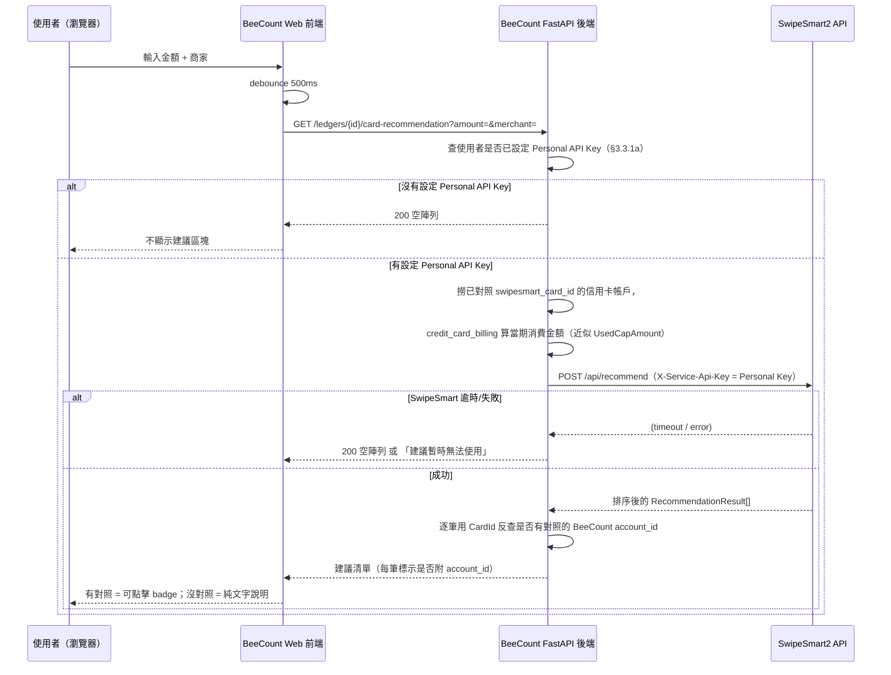
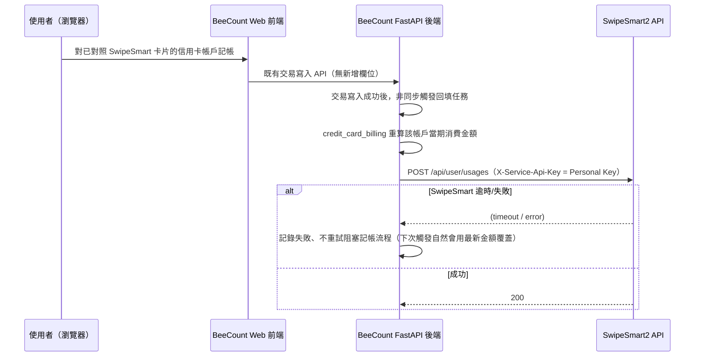

# 信用卡刷卡建議整合（SwipeSmart2）SD（Phase 14）

本文件是「記帳時提示最佳刷卡」功能的設計文件（SD）。目的是盤點 BeeCount
Cloud 與外部專案 `SwipeSmart2`（`/Users/andy/BeeCount-Cloud/SwipeSmart2`，
獨立的 .NET 信用卡回饋推薦引擎）之間的整合方式、雙邊各自需要的改動、以及
跨端影響。**本文件不包含任何程式改動**，實作留待下一輪按此文件展開（比照
`docs/PH13_PROJECT_SD.md` 的既有慣例：先寫 SD、之後分段做）。

---

## 0. 背景與目標

使用者需求：在 BeeCount 記帳表單輸入**金額**與**商家**時，希望能即時提示
「這筆消費刷哪張卡回饋最高」。使用者手上已經有一個獨立部署的 SwipeSmart2
專案（信用卡回饋推薦引擎，見 §1.1），希望直接借用它的推薦能力，而不是在
BeeCount 裡重新做一套回饋規則資料庫。同時使用者也已經意識到：

1. 不是每個人的信用卡都存在於 SwipeSmart 的卡片目錄裡，需要一個「帶入/
   對應哪些卡片」的機制。
2. SwipeSmart2 本身的需求（尤其是認證方式）可能也需要調整才能支援這種
   「被另一個系統呼叫」的用法。

**補充背景（使用者於 SD 初稿後追加的方向，已併入本版）**：

- BeeCount Web 有計畫改成 SSO 登入。若之後 BeeCount 與 SwipeSmart 共用同一
  個身分提供者，兩邊的使用者身分理論上可以互相對得起來，不必每個人手動申
  請/貼 API Key——這會是比較理想的長期身分綁定方式，但**依賴 BeeCount 尚
  未完成的 SSO 遷移**，因此設計上分兩條路徑並行（見 §3.2）：v1 先做「使用
  者自行貼上 SwipeSmart 個人 API Key」這條可以獨立運作、不受 SSO 遷移時程
  拖累的路徑，SSO 互通列入 §7 v2 之後視遷移進度再評估。
- 卡片對應**不做字串自動比對**（BeeCount 帳戶命名與 SwipeSmart 卡片命名不
  保證一致），改成使用者手動一一勾選對照的設定視窗（見 §3.3.1）。沒有對照
  到的情況下，建議仍然要顯示，只是降級成純文字說明、不能點擊代入帳戶（見
  §3.3.3）。
- 卡片目錄覆蓋率**不是風險**：使用者自行維護 SwipeSmart 的 MariaDB 卡片/
  規則庫，覆蓋率由使用者自己控制與擴充，不受外部限制（§5 原本列的「卡片
  目錄覆蓋率」風險移除）。
- 既然卡片綁定已經是使用者手動一一確認過的精確對應，「當期已刷金額」可以
  反向回填進 SwipeSmart 系統（BeeCount → SwipeSmart 的 usage 回填，新增
  §3.3.4），而不是單向只從 SwipeSmart 拉建議。

**與既有 `card_reward_rules`（§2.9.5，`src/services/card_rewards.py`）的
關係**：BeeCount 現有的信用卡回饋功能是使用者**自行維護**的規則，用於
**事後結算**（記帳當下手動勾選規則，系統依規則計算並可自動入帳回饋金
交易）。這次要做的是**消費前的即時建議**，資料來源是 SwipeSmart 既有、
持續維護的「銀行卡片實際回饋規則庫」，兩者目的不同、資料來源不同，**互
補共存，不取代**：SwipeSmart 負責「這筆消費建議用哪張卡」，BeeCount 既
有機制負責「這筆消費實際入帳了多少回饋」。

---

## 1. 現況調查

### 1.1 SwipeSmart2（外部專案）

技術棧：ASP.NET Core (.NET 10) Minimal API + MariaDB，前端為獨立的
Alpine.js 靜態頁面，OIDC（如 Synology SSO）+ Cookie Session 認證。

核心 API（`SwipeSmart2/src/CardStrategy.Api/Program.cs`）：

| Endpoint | 方法 | 認證 | 說明 |
|---|---|---|---|
| `/api/recommend` | POST | 任意登入者 | 依 `amount`/`merchantName`/`userUsages`/`favoriteCardIds`（**全部在 request body，無狀態**）計算並排序推薦卡片 |
| `/api/cards` | GET | 任意登入者 | 卡片目錄（`CardId`/`BankName`/`CardName`） |
| `/api/categories` | GET | 任意登入者 | 商家分類與別名 |
| `/api/rules` | GET | 任意登入者 | 回饋規則（卡片 × 分類） |
| `/api/cards`、`/api/categories`、`/api/rules` 的 POST/PUT/DELETE | - | `AdminPolicy` | 卡片/規則庫維護，僅管理員 |
| `/api/user/favorites`、`/api/user/usages`、`/api/user/cards-info` | GET/POST | 任意登入者（綁定 OIDC sub） | 使用者個人的常用卡片/已用額度/卡片機敏資訊，皆綁定 SwipeSmart 自己的使用者身分 |

**關鍵發現（決定了整合架構，見 §3）**：

- `POST /api/recommend`（`Program.cs:884-891`）的計算引擎
  `CardRecommendationEngine.CalculateBestCards`（`CardStrategy.Core/
  Services/CardRecommendationEngine.cs:21`）**完全吃 request body 傳入的
  參數**，不會去讀呼叫者自己在 SwipeSmart 資料庫裡的個人資料。也就是說，
  只要通過認證，任何呼叫者都能算「假設這個人有這些卡、已用這些額度」的
  推薦結果，**不需要呼叫方是 SwipeSmart 認識的特定使用者**。
- 但目前**唯一**的認證方式是 OIDC + Cookie（瀏覽器互動式登入），沒有任何
  service-to-service（API Key / client credentials）的管道。這代表 BeeCount
  後端目前**無法**直接呼叫 SwipeSmart 的 API——這是 §3.2 必須新增的部分。
- 卡片目錄是固定、由 Admin 手動維護的清單（`Data/cards_rules.json` 種子
  資料，實測目前僅 5 張卡，含 1 張 `TEST_CARD`），不是使用者自建。

### 1.2 BeeCount Cloud（本專案）現況

- 帳戶（含信用卡）是 **user-global** entity：`UserAccountProjection`
  （`src/models.py:698-738`），PK 為 `(user_id, sync_id)`，跨帳本共享，
  已有 `account_type`（`"credit_card"`）、`bank_name`、`card_last_four`、
  `credit_limit`、`billing_day`、`payment_due_day` 等欄位。
- 記帳表單金額與商家欄位：
  - `frontend/packages/web-features/src/features/TransactionsPanel.tsx:557-575`
    （金額 `form.amount`）與 `:863-867`（商家 `form.merchant`）——主要記帳
    表單。
  - `frontend/apps/web/src/components/GlobalEditDialogs.tsx`——全域編輯彈
    窗，**是另一份獨立維護的表單邏輯**（CLAUDE.md 已記錄過「帳戶必選」校
    驗要兩處同步改的既有模式），本功能若要在兩個入口都出現建議，兩處都要
    改。
- 帳戶選擇沿用共用元件 `AccountListRow`/`AccountPickerDialog`
  （`frontend/packages/web-features/src/components/AccountListRow.tsx`，
  CLAUDE.md Phase 10/11 補充）。
- 信用卡帳戶已有帳單週期計算服務 `src/services/credit_card_billing.py`
  （`compute_group_billing`/`compute_cycle_period_billing`），可以算出
  「當期已刷金額」，但語意跟 SwipeSmart 的 `CapAmount`（回饋金額上限）不
  是同一件事，見 §5 風險。
- 已有信用卡回饋規則 `ReadCardRewardRuleProjection`
  （`src/models.py:1142-1172`，user-global，PK=`(user_id, sync_id)`），
  是完全獨立於 SwipeSmart 的另一套資料，語意見 §0。

---

## 2. 範圍界定

**本階段要做**：

- 使用者在記帳表單輸入金額 + 商家後，顯示一個「建議刷卡」提示區塊：有綁
  定對應帳戶的建議可點擊直接帶入交易帳戶欄位；沒綁定對應帳戶的建議降級
  為純文字說明（銀行名+卡名+預估回饋），兩者都顯示，不因為沒綁定就整個
  不提示。
- 使用者在 BeeCount 貼上 SwipeSmart 個人 API Key 建立身分綁定後，透過一個
  「卡片對照」設定視窗，把自己的信用卡帳戶跟 SwipeSmart 卡片目錄一一手動
  勾選對應（見 §3.3.1）；沒有對應的信用卡帳戶單純不參與「反查帳戶」，不
  報錯、不擋記帳流程。
- SwipeSmart2 新增「個人 API Key」身分綁定機制（見 §3.2 Path B），取代原
  本設想的全域 service key——因為使用額度回填（見下一項）需要能代表「特
  定 SwipeSmart 使用者」寫入，不只是匿名服務對服務通行證。
- 已綁定信用卡的當期消費金額，回填至 SwipeSmart 該使用者的使用額度紀錄
  （見 §3.3.4），讓 SwipeSmart 推薦引擎的 `UsedCapAmount` 更準確。

**本階段不做（v2 才考慮，見 §7）**：

- 不做「自動選卡」：只提示、不會自動把交易的 `account_id` 改掉。
- 不把 SwipeSmart 回饋建議寫回 BeeCount 的回饋結算/自動入帳（那是既有
  `card_reward_rules`/`card_reward_payout` 的職責，兩套不打通）。
- 不讓 BeeCount 使用者透過本整合去新增/修改 SwipeSmart 的卡片或規則庫
  （維護權限仍集中在 SwipeSmart 自己的 Admin 後台）。
- 不做 BeeCount 與 SwipeSmart 之間的 SSO 身分互通（§3.2 Path A）：v1 先用
  個人 API Key，SSO 互通要等 BeeCount 自己的 SSO 遷移完成後再評估。

---

## 3. 整合架構

### 3.1 呼叫路徑：BeeCount 後端代理，前端不直連 SwipeSmart

```
瀏覽器（BeeCount Web）
      │  GET /ledgers/{id}/card-recommendation?amount=&merchant=
      ▼
BeeCount FastAPI backend（新 endpoint）
      │  POST /api/recommend  (X-Service-Api-Key)
      ▼
SwipeSmart2 API
```

理由：

- **避免 CORS**：SwipeSmart2 目前是同源靜態前端架構，沒有為外部網域開
  CORS；只為了這個整合放寬 CORS 會擴大攻擊面（任何網頁都能打它的
  `/api/recommend`）。
- **金鑰不落前端**：SwipeSmart 的服務位址與之後新增的 Service API Key
  （§3.2）留在 BeeCount 後端，不曝露到瀏覽器。
- **BeeCount 後端已經有算「當期已刷金額」需要的資料**（`credit_card_
  billing`），可以直接組出 SwipeSmart 需要的 `UserUsages`，不必讓
  SwipeSmart 認識 BeeCount 的使用者身分——呼應 §1.1 提到 `/api/recommend`
  本來就是無狀態、吃 body 參數的設計，剛好合用。

### 3.2 SwipeSmart2 需要新增的東西：使用者身分綁定（兩條路徑）

> 這是使用者提到「或許也需要修改 SwipeSmart 的需求」對應的部分，需要另外
> 排入 SwipeSmart2 自己的開發排程，不在本次 BeeCount 改動範圍內，但先在
> 這裡列清楚需求。

**為什麼不能只做一把全域 service key**：§3.3.4 的使用額度回填需要把資料
寫進「某一個特定 SwipeSmart 使用者」的帳號下（`/api/user/usages` 本來就
是綁定 `InternalUserId` 的個人資料），單純「服務對服務、不代表任何人」的
匿名金鑰做不到這件事。因此認證機制要能代表個別 SwipeSmart 使用者身分，
不是只開放幾支唯讀端點而已。

**Path A（理想長期方案，依賴 BeeCount 尚未完成的 SSO 遷移）**：如果
BeeCount Web 之後改用跟 SwipeSmart 相同的 OIDC 身分提供者，兩邊使用者的
`sub`/email 天然一致。BeeCount 後端要能「代表這個使用者」呼叫 SwipeSmart，
技術上需要 Provider 支援 token exchange / on-behalf-of 之類的流程，讓
BeeCount 後端拿到一個 audience 含 SwipeSmart 的 token 轉呼叫——這已經是身
分治理層級的改動，需要跟 SwipeSmart 的 OIDC 設定一起評估，**本階段不做**
（列入 §7 v2，待 SSO 遷移排定後再回頭設計）。

**Path B（v1 採用，不依賴 SSO 遷移，可獨立運作）**：SwipeSmart 新增「個人
API Key」機制：

1. SwipeSmart 使用者登入後在自己的設定頁產生一把綁定自己 `InternalUserId`
   的 Personal Access Token（比照常見的 PAT 模式，可命名、可撤銷、可設多
   把）。
2. 使用者把這把 Key 貼到 BeeCount「帳戶設定」裡的新欄位（見 §3.3.1），
   BeeCount 加密儲存（比照 SwipeSmart 自己對 CVV/卡號等敏感欄位的 AES 加
   密模式，不能明文落地）。
3. SwipeSmart 新增一個 Authorization Policy（例如
   `PersonalKeyOrCookiePolicy`）：帶 `X-Service-Api-Key` header 時，先反
   查資料庫比對出對應的 `InternalUserId`，成功則注入等同該使用者 Cookie
   登入的 `ClaimsPrincipal`；沒帶或查無此 key 則退回原本的 OIDC Cookie 驗
   證流程。套用範圍涵蓋 `/api/recommend`、`/api/cards`、`/api/categories`、
   `/api/rules`（GET）**與** `/api/user/favorites`、`/api/user/usages`、
   `/api/user/cards-info`（因為現在是代表該使用者，不是匿名服務金鑰，理
   論上可以存取這個使用者自己的個人端點）。Admin 寫入端點（卡片/規則庫
   維護）維持原本 Cookie-only，Personal Key 不給予 Admin 權限。
4. `POST /api/recommend` 的介面本身**不需要改**——已經是無狀態設計（見
   §1.1）；但因為 Personal Key 現在能代表使用者身分，`UserUsages`/
   `FavoriteCardIds` 可以考慮讓 SwipeSmart 自己從該使用者的既有資料庫紀
   錄帶入（BeeCount 不必每次都自己組），實際要不要開放這個「省略 body、
   用身分自動帶入」的子選項，留給實作階段跟 SwipeSmart 一起定案。
5. **待確認**：`/api/user/usages` 目前的寫入語意是 `UsedCapAmount`（已用
   掉的回饋上限金額），BeeCount 端能直接算出來的是「當期消費金額」，兩者
   不是同一個數字（見 §5、§3.3.4）。是否要讓 SwipeSmart 這支端點改成接受
   「消費金額」並自己用規則庫換算成 `UsedCapAmount`，還是維持現狀由呼叫
   方自己算好精確值再寫入，需要在實作前定案。
6. 待確認：SwipeSmart2 是否部署在 BeeCount 後端可觸及的網路（內網/對外
   網域 + 反向代理），這是部署層面，不是程式改動，但會決定 §3.3.3/§3.3.4
   的呼叫方式與逾時/重試策略要怎麼設計。

### 3.3 BeeCount 需要新增的東西

#### 3.3.1 身分綁定 + 卡片對照（「帶入卡片」機制）

分兩層，一層是「使用者身分」，一層是「卡片對應」：

**(a) SwipeSmart 個人 API Key（使用者層級，非帳戶層級）**

使用者在 BeeCount 個人設定（不是某一個帳戶底下）貼上 §3.2 Path B 的
Personal API Key。這是機敏資料，**不透過 sync 機制**（不進 `sync_
changes`/projection，不同步到其他裝置的本地明文），存放在使用者對應的
核心資料表裡並加密（比照 SwipeSmart 自己對 CVV/卡號的 AES 加密模式），
具體落地哪張表待實作階段確認（例如使用者帳號設定表新增一個加密欄位），
**不是**本 SD §3.3.1(b)/§6 SOP 講的 sync entity 欄位。

**(b) 信用卡帳戶 ↔ SwipeSmart 卡片：手動對照視窗（不做字串自動比對）**

`UserAccountProjection` 新增 nullable 欄位 `swipesmart_card_id: str | None`
（對應 SwipeSmart 的 `CardId`），只有 `account_type == "credit_card"` 才
有意義（沿用 `card_reward_rules.py::_assert_account_is_credit_card` 現有
校驗模式，見 `src/routers/write/card_reward_rules.py:25-37`）。這個欄位本
身照樣走 sync entity 欄位新增流程（§6）。

- **UI 不是單張帳戶下拉選單，而是一個批次「卡片對照」設定視窗**：貼完
  Personal API Key 後（或之後任何時候重新打開設定），彈出一個對照畫面，
  左邊列出使用者名下所有 `account_type == "credit_card"` 的 BeeCount 帳
  戶，右邊列出 SwipeSmart 卡片目錄（§3.3.2 快取的 `/api/cards`；若該使用
  者在 SwipeSmart 自己的 `/api/user/cards-info` 已經登錄過卡片，優先把這
  些卡排在前面縮小選擇範圍），使用者針對每一張 BeeCount 信用卡帳戶手動勾
  選要對應的 SwipeSmart 卡片。**不做名稱字串自動比對**——兩邊卡片命名習
  慣不保證一致（例如 BeeCount 帳戶叫「國泰現金回饋卡」，SwipeSmart 目錄
  可能叫「Cathay CUBE 卡」），自動比對容易配錯。
- 沒有設定 Personal API Key，或設定了但某張信用卡帳戶沒有在對照視窗裡被
  勾選對應：這張帳戶**不參與「反查帳戶並可點擊代入」**，但不代表完全沒有
  建議可看——見 §3.3.3 的降級行為（純文字顯示，不可點擊）。
- 欄位新增的 4 個改動點，比照 `avatar_cloud_file_id` 當初新增時的改動點
  （CLAUDE.md Phase 提到的模式）：
  1. `src/routers/write/accounts.py`：schema 加欄位、更新端點透傳。
  2. `src/projection.py::upsert_account`：`values` dict 補
     `"swipesmart_card_id": _as_str(payload.get("swipesmartCardId"))`。
  3. `src/sync_applier.py`：帳戶的 merge spec 加一組
     `("swipesmartCardId", "swipesmart_card_id")`。
  4. `src/snapshot_builder.py`：帳戶 SELECT 加這個欄位（⚠️ CLAUDE.md 記過
     的既有陷阱——漏了這步，下一次 partial update 會把這欄位讀成空值再
     悄悄覆蓋掉）。
  - 因為是單純的 nullable 字串欄位（不是敏感個資、不影響金額計算），補一
    個 `test_account_swipesmart_card_id_partial_update_keeps_existing_field`
    風格的測試即可（比照 CLAUDE.md 7 步 SOP 第 7 項）。Personal API Key
    本身因為不走 sync，測試方式不同（見 §6）。

#### 3.3.2 卡片目錄快取

BeeCount 後端定期（例如每天一次背景排程，或第一次請求時 lazy fetch +
TTL 快取，如 1 小時）呼叫 SwipeSmart `GET /api/cards` 抓目錄，暫存供
§3.3.1(b) 的「卡片對照」設定視窗使用（使用者確認卡片目錄由自己維護、
會持續擴充，快取策略要抓「量變大也不太貴」的 TTL 記憶體快取即可，不需要
一開始就落地成正式資料表；若之後真的量大到記憶體快取不划算，再考慮落地
一張唯讀快取表，見 §7）。

#### 3.3.3 推薦 API

新增 `GET /ledgers/{ledger_id}/card-recommendation?amount=<decimal>&merchant=<str>`
（比照現有 read router 慣例放在 `src/routers/read/ledgers.py` 或
`workspace.py`；金額+商家屬於查詢輸入，用 GET + query params 而非 POST）。

內部邏輯：

1. 使用者沒有設定 Personal API Key（§3.3.1(a)）：無法呼叫 SwipeSmart，直
   接回傳空陣列，前端不顯示建議區塊。
2. 有設定 Personal API Key：**不論有沒有任何信用卡帳戶對應到 SwipeSmart
   卡片，都照樣呼叫** `POST /api/recommend`——因為 SwipeSmart 的推薦結果
   是「全目錄排序」，即使一張都沒對應，也能告訴使用者「理論上刷哪張卡最
   划算」，只是沒辦法幫你點一下就代入帳戶欄位（見 §3.3.5 前端呈現）。
3. 對每張已對照的信用卡，用既有 `credit_card_billing` 服務算出當期消費金
   額，組成 SwipeSmart `UserUsages`；若 §3.2 Path B 第 4 點採用「讓
   SwipeSmart 自己從該使用者資料庫帶入 usages/favorites」的子選項，這一步
   可以省略，改成單純帶 `amount`/`merchantName` 讓 SwipeSmart 用 Personal
   Key 對應的身分自己查（實作階段定案）。
4. 組出 `RecommendRequest`，帶 Personal API Key（`X-Service-Api-Key`）呼叫
   SwipeSmart `POST /api/recommend`。
5. 把 SwipeSmart 回傳結果裡的每一筆 `Card.CardId`，逐一嘗試反查使用者是
   否有 BeeCount 帳戶對照到這張卡（§3.3.1(b) 的對照表）：查得到就附上
   `account_id`/`account_name`（前端可點擊、highlight）；查不到就只回傳
   卡片本身資訊（銀行名/卡名/預估回饋），前端降級為純文字顯示。
6. SwipeSmart 呼叫失敗（逾時/服務不可用）時**優雅降級**：回傳空陣列或
   明確的「建議暫時無法使用」狀態，**絕不能因為外部服務掛掉而擋住記帳**
   （這是外部依賴的硬性容錯要求，比照現有其他外部服務呼叫的既有原則）。

#### 3.3.4 使用額度回填（BeeCount → SwipeSmart）

呼應「卡片綁定既然已經是使用者手動一一確認過的精確對應，當期已刷金額就
可以回填進 SwipeSmart」這個方向，新增一條反向資料流：

- **觸發時機**：使用者對一個已在 §3.3.1(b) 對照過 SwipeSmart 卡片的信用
  卡帳戶完成記帳（新增/修改/刪除交易）後，非逐筆即時同步，而是非同步觸
  發（例如寫入交易後丟一個背景任務，或跟卡片目錄快取一樣採週期性批次重
  算），避免記帳這個熱路徑被外部呼叫拖慢或被 SwipeSmart 暫時不可用擋住
  （沿用 §3.3.3 第 6 點「外部依賴不能擋主流程」的原則）。
- **算什麼**：用既有 `credit_card_billing` 重新算出該帳戶「當期累積消費
  金額」。
- **寫什麼、语意落差怎麼處理**：見 §3.2 Path B 第 5 點——SwipeSmart
  `/api/user/usages` 目前語意是 `UsedCapAmount`（已用掉的回饋上限金額），
  不是消費金額本身。本 SD 建議方向是**回填「消費金額」，由 SwipeSmart 自
  己的規則庫換算成 `UsedCapAmount`**（BeeCount 不該重新實作一份回饋换算
  公式跟商家分類比對邏輯），但這代表 SwipeSmart `/api/user/usages` 的寫入
  介面可能需要跟著調整以接受消費金額——這是 §3.2 明確列給 SwipeSmart 的
  待確認需求之一，不是 BeeCount 這邊能單方面定案的。（這裡的消費金額，就是在
  SwipeSmart裡面的usages使用額度，你需要取得現在額度，然後再像上加，由於
  信用卡在BeeCount是有區間的，所以每次回填都要以消費的信用卡帳單區間為主）
- 呼叫方式沿用 §3.2 Path B：帶 Personal API Key 呼叫
  `POST /api/user/usages`，SwipeSmart 反查出 `InternalUserId` 後寫入該使
  用者自己的使用額度紀錄。

#### 3.3.5 前端

`TransactionsPanel.tsx`（金額 `:557-575`、商家 `:863-867`）與
`GlobalEditDialogs.tsx`（兩個編輯入口都要改，理由同 §1.2）：

- 金額與商家皆非空時，debounce（例如 500ms）呼叫 §3.3.3 的新 API。
- 建議依「有沒有反查到 BeeCount 帳戶」分兩種呈現：
  - **有對應帳戶**：可點擊的 badge，例如「建議刷：OO銀行 OO卡（預估回饋
    $xx，x.x%）」，點擊 = 把對應的 `account_id` 帶入表單的帳戶欄位（使用
    者主動點擊才生效，不自動代填，呼應 §2 範圍界定）。
  - **沒有對應帳戶**（使用者沒設 Personal API Key 之外的情況，即有 Key
    但這張推薦卡沒在 §3.3.1(b) 對照過）：純文字小字說明，例如「這筆消費
    刷「OO銀行 OO卡」回饋較高（未綁定此卡，無法直接帶入）」，不可點擊。
  - 可能有多張候選時列出排序前幾名，兩種呈現可以並列。
- 完全沒有建議可顯示的情況只剩「使用者沒設定 Personal API Key」或
  「SwipeSmart 服務不可用」兩種，此時**不顯示**這個區塊，不影響既有記帳
  流程。
- 沿用 CLAUDE.md 記錄的「前端 UI 驗證要求」——完成後要實際在瀏覽器操作一
  遍，不能只憑型別檢查/測試通過就宣稱完成。

---

## 4. 資料流程圖

### 4.1 推薦建議（讀）



### 4.2 使用額度回填（寫，§3.3.4）



---

## 5. 風險與待確認事項

- **`CapAmount`/`UsedCapAmount` 語意落差（現在有 §3.3.4 回填機制，但仍需
  定案）**：SwipeSmart 的 `CapAmount` 是「加碼回饋金額上限」（例如每期上
  限 $300 回饋金），不是信用額度或消費金額。§3.3.4 讓 BeeCount 能把當期
  消費金額回填給 SwipeSmart，但**回填的是消費金額，不是 SwipeSmart 語意
  下的 `UsedCapAmount`**——這兩個數字只有在「回饋率剛好 100%」時才會相
  等。需要 SwipeSmart 那邊決定：(a) `/api/user/usages` 改成接受消費金額，
  由 SwipeSmart 自己用規則庫換算成真正的 `UsedCapAmount`（本 SD 建議方
  向，見 §3.2 Path B 第 5 點），或 (b) 維持現狀要求呼叫方直接算好精確
  `UsedCapAmount` 再寫入（會逼 BeeCount 重做一份回饋公式 + 商家分類比對
  邏輯，不建議）。這是需要跟 SwipeSmart 那邊一起定案的具體項目，不是
  BeeCount 單方面能解決的。
- **卡片目錄覆蓋率**：使用者已確認不是風險——SwipeSmart 的 MariaDB 卡片/
  規則庫由使用者自己維護與擴充，不受外部公開目錄限制。
- **部署連通性**：SwipeSmart2 是私有部署（Docker/NAS），需要確認 BeeCount
  後端所在主機能不能連到 SwipeSmart 的服務位址（內網直連，或需要對外網
  域 + 反向代理），這會決定 §3.3.3/§3.3.4 的逾時/重試策略設計。
- **商家字串比對**：SwipeSmart 端是「別名/模糊比對」字串邏輯（`Card
  RecommendationEngine.cs:21-172`），BeeCount 商家欄位是自由輸入文字，簡
  繁體、空格、品牌全名 vs 簡稱都可能造成比對不到——先以 SwipeSmart 既有
  「比對不到就退回一般消費規則」的行為為底線，本階段不在 BeeCount 端另
  外做商家名稱正規化/字典。
- **Personal API Key 保管**：使用者貼進 BeeCount 的 SwipeSmart 個人金鑰是
  高敏感資料（等同該使用者在 SwipeSmart 的完整個人身分），BeeCount 端必
  須加密儲存、絕不能明文落地、也不能透過 sync 機制同步到其他裝置的本地
  明文快取（見 §3.3.1(a)），`docs/DEPLOYMENT.md`/資安檢查清單需要同步補
  充這個新的機敏資料類別。
- **SSO 互通（Path A）與 API Key（Path B）並存的過渡期**：BeeCount 的 SSO
  遷移時程目前未定，若之後 SSO 上線，需要規劃「已經用 Path B 貼過 Personal
  Key 的使用者」要不要/如何遷移到 Path A，避免屆時兩套機制互相打架或使用
  者要重新設定一次。
- **使用額度回填的觸發頻率**：§3.3.4 選擇「交易寫入後非同步觸發」而非逐
  筆即時同步，實際批次/防抖策略（例如同一帳戶短時間內多筆交易只回填最後
  一次算出來的總額，而不是每筆都打一次 API）需要在實作階段定出具體門檻，
  避免對 SwipeSmart 造成不必要的請求量。

---

## 6. 7 步 SOP checklist（`swipesmart_card_id` 帳戶新增欄位規模，照
CLAUDE.md「新增或修改 Sync Entity 檢查清單」）

> 這 7 步只涵蓋 §3.3.1(b) 的卡片對照欄位（`swipesmart_card_id`）。§3.3.1(a)
> 的 Personal API Key **不走這套流程**——它不是 sync entity 欄位，是使用
> 者層級的機敏設定，走一般後端 secret 儲存/獨立的（讀取遮罩、寫入更新）
> API，不需要 projection/sync_applier/snapshot_builder 這幾步，但一樣需要
> 補測試（加密儲存正確、API 回應絕不回傳明文金鑰）。

1. **DB & Migration**：`user_account_projection` 新增 `swipesmart_card_id`
   欄位（nullable String）+ Alembic migration。
2. **Projection**：`src/projection.py::upsert_account` 補
   `"swipesmart_card_id": _as_str(payload.get("swipesmartCardId"))`。
3. **Sync Applier**：`src/sync_applier.py` 帳戶 merge spec 加
   `("swipesmartCardId", "swipesmart_card_id")`。
4. **Write Routers**：`src/routers/write/accounts.py` 的建立/更新 schema
   加欄位（PATCH 需比照既有欄位允許顯式清空 = 解除綁定）。
5. **Read Routers**：帳戶讀取端點回傳這個欄位；新增
   `GET /ledgers/{id}/card-recommendation`（§3.3.3）、卡片目錄查詢端點
   （供對照視窗用，§3.3.2）、Personal API Key 的讀取（遮罩顯示）/寫入/
   刪除端點（§3.3.1(a)，獨立於這 7 步之外）。
6. **Snapshot Builder**（⚠️ 最容易漏）：`src/snapshot_builder.py` 帳戶
   SELECT 加這個欄位。
7. **測試**：帳戶 partial-update 契約測試（`swipesmart_card_id` 不隨其他
   欄位更新被靜默清空）+ `card-recommendation` 端點測試（沒設 Personal Key
   回空陣列、有 Key 但無對照卡片仍回傳純文字建議、SwipeSmart 逾時時優雅
   降級、CardId 正確反查回 account_id）+ §3.3.4 回填端點測試（觸發時機、
   SwipeSmart 失敗不阻塞交易寫入）。

---

## 7. v2 / 之後才考慮

- **SSO 身分互通（§3.2 Path A）**：待 BeeCount 完成 SSO 遷移後，評估讓
  BeeCount 與 SwipeSmart 共用身分提供者，取代/補強 Path B 的 Personal API
  Key 手動貼入流程。
  
- 讓使用者在 BeeCount 端回報「這張卡的規則好像過期/不對」，或提交「新增
  卡片申請」，轉呼叫 SwipeSmart 寫入 API 或另建一個審核佇列——需要另外設
  計權限模型，避免任何 BeeCount 使用者能直接改到 SwipeSmart 全域共用的
  規則庫。
  
- 卡片目錄快取落地成正式資料表（若目錄量變大，或需要在 SwipeSmart 離線
  時仍能顯示卡片清單）。
  
- 把 `card_reward_rules`（結算）與 SwipeSmart（建議）的資料在 UI 上做更
  深的關聯呈現（例如記帳表單同時看到「SwipeSmart 建議」與「我自己設定的
  回饋規則」哪個回饋更高），本階段先各自獨立顯示即可。
  
  
