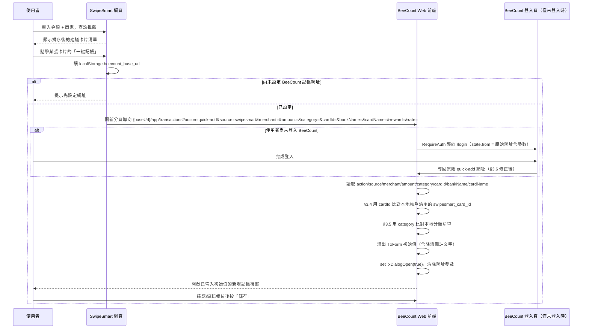

# SwipeSmart 推薦「一鍵記帳」SD（Phase 15）

本文件是「在 SwipeSmart 查完刷卡建議後，一鍵把商家/金額/建議信用卡帶入
BeeCount 開新增記帳視窗」功能的設計文件（SD）。**本文件不包含任何程式
改動**，實作留待下一輪按此文件展開（比照 `docs/PH13_PROJECT_SD.md`、
`docs/PH14_SWIPESMART_CARD_RECOMMEND_SD.md` 既有慣例：先寫 SD、之後分段
做）。

---

## 0. 背景與目標

Phase 14（`docs/PH14_SWIPESMART_CARD_RECOMMEND_SD.md`，已實作完成，commit
`b4435db 加入推薦回饋`）做的是「**BeeCount 記帳表單裡即時問 SwipeSmart**」：
使用者在 BeeCount 記帳時輸入金額+商家，BeeCount 後端代理呼叫 SwipeSmart
`POST /api/recommend`，把建議顯示在記帳表單裡。

這次要做的方向**相反**：使用者的起點是 **SwipeSmart 自己的網頁**（
`wwwroot/index.html`，使用者本來就會為了單純「查一下這筆消費刷哪張卡」而
打開它，不見得同時在記帳），查完建議後，希望**直接從 SwipeSmart 這筆建議
按一個按鈕**，就能跳轉到 BeeCount、開好一筆已經帶入商家/金額/建議信用卡
的新增記帳視窗，**由使用者自己確認/編輯後儲存**——不是自動記帳，只是省
去重新手動輸入一次的功夫。

兩者互補、觸發方向不同、不互相取代：

| | Phase 14 | Phase 15（本文件） |
|---|---|---|
| 起點 | BeeCount 記帳表單 | SwipeSmart 推薦結果 |
| 呼叫方式 | 後端對後端（BeeCount → SwipeSmart API） | 純瀏覽器導航（Deep Link，無新後端 API） |
| 資料方向 | SwipeSmart 建議 → 顯示在 BeeCount 表單 | SwipeSmart 建議 → 帶入 BeeCount 表單初始值 |
| 使用情境 | 使用者已經在記帳，順便問建議 | 使用者只是想先查建議，之後才想記帳 |

**關鍵前提（Phase 14 已經打好的基礎，本階段直接沿用、不重做）**：

- `UserAccountProjection.swipesmart_card_id`（`src/models.py:750`）——BeeCount
  信用卡帳戶 ↔ SwipeSmart `CardId` 的對照欄位，已存在且已有自動比對機制
  （`src/services/swipesmart_matching.py`）。
- 帳戶讀取端點已經會回傳這個欄位（PH14 §6 SOP 第 5 項），代表 BeeCount
  **前端**目前載入的帳戶清單裡，每個信用卡帳戶物件上已經有
  `swipesmart_card_id`，可以直接在前端比對，**不需要新的後端 API**。

這個前提讓本階段的實作範圍大幅縮小：本質上是「一個 URL 參數規格 + 兩邊
各自的前端改動」，沒有新的伺服器對伺服器呼叫、沒有新的認證機制。

---

## 1. 現況調查

### 1.1 SwipeSmart 推薦結果 UI

單頁 Alpine 應用 `SwipeSmart/src/CardStrategy.Api/wwwroot/index.html`：

- 輸入：金額 `amount`（:204-207）、商家 `merchantName`（:210-236，含自動完
  成）。
- `calculate()`（:1933-1980）呼叫 `POST /api/recommend`，回傳排序後的
  `RecommendationResult[]`，綁定到 `recommendations` 陣列。
- 結果卡片列表（:355-420，`x-for="res in recommendations"`），每筆卡片在
  作用域內已經能直接存取 `res.card.cardId`／`res.card.bankName`／
  `res.card.cardName`／`res.estimatedReward`／`res.effectiveRate`／
  `res.matchedCategoryName`／`res.ruleName`，以及外層的 `amount`／
  `merchantName`。**這個卡片區塊就是加「一鍵記帳」按鈕的位置**，所有需要
  的欄位都已經在作用域內，不需要額外打 API 取資料。

`RecommendationResult` 定義：`SwipeSmart/src/CardStrategy.Core/Models/
RecommendationResult.cs`——`Card`／`RuleName`／`EstimatedReward`／
`EffectiveRate`／`BaseRate`／`BonusRate`／`AlertMessages`／`Note`／
`IsFavorite`／`MatchedCategoryName`／`MatchedAlias`。

SwipeSmart 目前**沒有**任何「分享/匯出/deep link」機制、沒有行動端外殼，
純網頁應用，因此本次要新增的「一鍵記帳」按鈕就是一個 `<a target="_blank">`
連結，導到 BeeCount 的網址。

### 1.2 BeeCount 既有 Deep Link 機制（`?action=quick-add`）

`frontend/apps/web/src/pages/sections/TransactionsPage.tsx:1101-1141` 已經
有一套「用網址參數觸發開新增記帳視窗」的既有模式（原本是給 PWA Share
Target／捷徑用的），流程：

```ts
const action = searchParams.get('action')
const range = searchParams.get('range')
if (action === 'quick-add' && canWriteTx) {
  const shareText = consumePendingShareText()
  // ...composed → setTxForm(prev => ({ ...prev, note: composed }))
  setTxDialogOpen(true)
  consumed.push('action')
}
```

現況只讀 `action`／`range`／（`ShareIncomingPage` 另外用掉的）`source`
三個參數，**沒有** `merchant`／`amount`／`category` 等欄位——這是本階段
要擴充的部分。

`TransactionsPage` 掛在扁平路由 `/app/transactions`（`App.tsx:221-228`），
**不是** `/app/ledgers/:id/...`，帳本（ledger）情境來自
`useLedgers().activeLedgerId`，實際存放在 `localStorage`
（`beecount.active-ledger.${sessionUserId}`，`AppShell.tsx:67-108`，找不到
就 fallback 第一個帳本）。也就是說 quick-add 連結**本來就是帳本無關**的
——一律落在使用者當下「作用中帳本」，本階段沿用這個既有限制，不新增帳本
選擇 UI（見 §5）。

### 1.3 登入態遺失問題（既有 Bug，本階段需要一併修正）

`frontend/apps/web/src/app/router.tsx` 的 `RequireAuth`：

```tsx
if (!isAuthed) {
  return <Navigate to="/login" replace state={{ from: location }} />
}
```

`location`（含 `search`）有被存進 `state.from`，但 `App.tsx:202-208` 的
`LoginPage onLoggedIn` **目前寫死**：

```tsx
onLoggedIn={(nextToken) => {
  setToken(nextToken)
  navigate('/app/overview', { replace: true })
}}
```

完全沒有讀 `location.state.from`。代表：如果使用者從 SwipeSmart 點「一鍵
記帳」時，BeeCount Web 剛好處在未登入/過期狀態，會被彈去 `/login`，登入
成功後固定送到總覽頁，**整個 quick-add 網址參數（商家/金額/建議卡片）就
遺失了**，使用者要重新手動輸入一次，完全喪失「一鍵」的意義。這不是本階
段新增的問題，是既有 Bug，但因為本功能高度依賴「連結上的參數不能中途弄
丟」，必須在本階段一併修正（見 §3.6）。

### 1.4 分類比對——目前沒有現成機制

Phase 14 只做了「信用卡帳戶 ↔ SwipeSmart 卡片」的比對
（`swipesmart_matching.py`），**沒有**「BeeCount 分類 ↔ SwipeSmart
`matchedCategoryName`」的比對機制。兩邊分類命名系統完全獨立（BeeCount
分類是使用者自建的 user-global/ledger 分類；SwipeSmart 分類是它自己的
`Category`/`Aliases` 資料表），本階段需要新增一個**前端、best-effort**
的名稱比對（見 §3.5），比照 PH14 SD §5 提到的「商家字串比對」風險同一等
級的態度：比對不到就不比對，不因此擋住流程。

---

## 2. 範圍界定

**本階段要做**：

- SwipeSmart 推薦結果每一張卡片，新增「一鍵記帳」按鈕，點擊後在新分頁開
  啟 BeeCount，網址帶上商家/金額/建議分類/建議卡片等參數（§3.2）。
- SwipeSmart 新增一個「BeeCount 記帳網址」設定（存在瀏覽器
  `localStorage`，不經後端），供使用者自己填一次（見 §3.1）。
- BeeCount `TransactionsPage.tsx` 的 quick-add handler 擴充讀取新參數，
  開啟新增交易視窗並帶入初始值（§3.3）。
- 信用卡帳戶反查：沿用 Phase 14 已存在的 `swipesmart_card_id` 欄位，前端
  直接比對，比對到就帶入 `account_name`；沒比對到就留空（基礎值），改把
  建議卡片的銀行名/卡名寫進備註，供使用者自己判斷（§3.4）。
- 分類反查：新增前端 best-effort 名稱比對，比對到「剛好一筆」BeeCount
  分類才帶入；比對不到（0 筆或多筆）就留空（基礎值），原始建議分類名稱
  一樣寫進備註（§3.5）。
- 修正 §1.3 的登入態參數遺失問題：`LoginPage`/`App.tsx` 登入成功後導回
  `location.state.from`（含原始 querystring）而不是寫死 `/app/overview`
  （§3.6）。

**本階段不做（v2 才考慮，見 §7）**：

- 不做「自動送出/自動記帳」：一律只是**開好視窗、帶入初始值**，使用者仍
  要自己按「儲存」，呼應使用者原始需求「由使用者自己去做後續的編輯」。
- 不新增後端 API：全程只有前端改動 + SwipeSmart 靜態頁面改動，因為所需
  資料（`swipesmart_card_id`）已經隨帳戶清單存在於 BeeCount 前端狀態
  裡，不需要再打一次後端。
- 不做帳本（ledger）選擇：沿用現況「一律落在作用中帳本」的既有限制，不
  在 URL 參數裡帶 `ledgerId`。
- 不處理 SwipeSmart 端「BeeCount 記帳網址」的多裝置同步：v1 就是單純瀏覽
  器 `localStorage`，換瀏覽器/裝置要重填一次（見 §5）。
- 不做「消費日期」以外時間相關欄位（例如帳單週期）的帶入——SwipeSmart的
  推薦計算本來就不是日期相關的，沿用當下時間作為預設交易日期即可。

---

## 3. 整合架構

### 3.1 SwipeSmart 端：BeeCount 記帳網址設定（純前端、localStorage）

在 `wwwroot/index.html` 既有設定/個人化區塊（或右上角新增一個小齒輪/連結
圖示）新增一個文字輸入框「BeeCount 記帳網址」，儲存進
`localStorage.setItem('beecount_base_url', value)`。

- 這是單一使用者私有部署的個人化設定，不需要落地到 SwipeSmart 後端/
  資料庫，比照純前端 UI 偏好設定的既有慣例（例如常用卡片這類個人化資料
  雖然有後端 `/api/user/favorites`，但這個是「另一個系統的網址」，語意上
  更接近瀏覽器層級設定，沒有跨裝置同步的必要性，故選擇最輕量的做法）。
- 未設定時，「一鍵記帳」按鈕改成提示使用者先去設定（例如點擊時彈出
  `prompt()` 或導向設定區塊），不隱藏按鈕本身（讓使用者知道有這個功能，
  只是要先設定一次）。
- 值的格式：不含結尾斜線的 origin，例如 `https://beecount.example.com`；
  組網址時固定接 `/app/transactions`。

### 3.2 Deep Link 參數規格

「一鍵記帳」按鈕（`index.html` 結果卡片區塊，:397-420 附近）產生的網址：

```
{beecount_base_url}/app/transactions
  ?action=quick-add
  &source=swipesmart
  &merchant=<urlencode(merchantName)>
  &amount=<amount>
  &category=<urlencode(res.matchedCategoryName ?? '')>
  &cardId=<urlencode(res.card.cardId)>
  &bankName=<urlencode(res.card.bankName)>
  &cardName=<urlencode(res.card.cardName)>
  &reward=<res.estimatedReward>
  &rate=<res.effectiveRate>
```

| 參數 | 來源（SwipeSmart 端變數） | 必填 | 用途 |
|---|---|---|---|
| `action` | 固定字串 `quick-add` | 是 | 沿用既有 quick-add 觸發機制 |
| `source` | 固定字串 `swipesmart` | 是 | 區分觸發來源（既有 `source` 參數已被 share-target 用於 `shortcut`/`share-text`/`share-image`，新增一個值，不衝突） |
| `merchant` | 外層 `merchantName`（使用者輸入） | 是 | 帶入 `TxForm.merchant` |
| `amount` | 外層 `amount`（使用者輸入） | 是 | 帶入 `TxForm.amount` |
| `category` | `res.matchedCategoryName` | 否（可能是 `null`） | 供 §3.5 分類比對用，比對不到就只進備註 |
| `cardId` | `res.card.cardId` | 是 | 供 §3.4 帳戶反查用 |
| `bankName` | `res.card.bankName` | 是 | 沒反查到帳戶時的備註文字用 |
| `cardName` | `res.card.cardName` | 是 | 同上 |
| `reward` | `res.estimatedReward` | 否 | 備註文字用（預估回饋金額） |
| `rate` | `res.effectiveRate` | 否 | 備註文字用（有效回饋率） |

沒有 `date` 參數：SwipeSmart 的推薦計算本來就不綁日期，交易日期沿用
BeeCount 新增交易視窗原本的預設值（今天）即可，使用者若是為過去某筆消費
查建議、記帳時自己改日期。

### 3.3 BeeCount 端：quick-add handler 擴充

`TransactionsPage.tsx:1101-1141` 的 `useEffect` 擴充：

1. `source === 'swipesmart'` 時，額外讀取 `merchant`／`amount`／
   `category`／`cardId`／`bankName`／`cardName`／`reward`／`rate`。
2. `amount` 需驗證為正的有限數字才帶入，否則忽略（不讓表單吃到無效值當
   掉）；`merchant`／`category`／`bankName`／`cardName` 都是自由文字，直
   接 `decodeURIComponent`（`URLSearchParams` 已自動處理）後帶入，做長度
   上限截斷（比照既有欄位長度限制）防止超長網址塞爆表單。
3. 帳戶反查（§3.4）與分類比對（§3.5）跑完後，一次性用
   `setTxForm(prev => ({ ...prev, merchant, amount, account_name, category_name, note }))`
   寫入表單初始值，接著 `setTxDialogOpen(true)` 開啟既有新增交易視窗——
   使用者看到的就是平常那個新增記帳表單，只是欄位已經被帶入，可以直接
   改或直接存。
4. 參數消費完畢後一樣呼叫 `setSearchParams(next, { replace: true })` 清掉
   網址上的參數（沿用既有 `consumed` 陣列模式），避免使用者重新整理頁面
   時重複觸發。
5. **只改 `TransactionsPage.tsx` 這一個入口，不改 `GlobalEditDialogs.tsx`**
   ——`GlobalEditDialogs.tsx` 是「編輯既有交易」的彈窗，本功能是「新增」
   情境，跟既有 `?action=quick-add` 機制原本就只接在 `TransactionsPage`
   一致，沒有理由改到編輯彈窗。

### 3.4 信用卡帳戶反查（沿用 Phase 14 `swipesmart_card_id`）

BeeCount 前端本來就有目前使用者的帳戶清單狀態（含 `account_type`／
`swipesmart_card_id`，Phase 14 已經讓讀取端點回傳這個欄位）。新增一個純
前端函式（例如放在 `frontend/packages/web-features/src/lib/` 或就近寫在
`TransactionsPage.tsx`）：

```ts
function findAccountBySwipesmartCardId(accounts: Account[], cardId: string): Account | null {
  const hit = accounts.find(
    (a) => a.account_type === 'credit_card' && !a.hidden && a.swipesmart_card_id === cardId
  )
  return hit ?? null
}
```

- 找到：`account_name` 帶入該帳戶名稱（可點擊視覺上跟平常選帳戶一樣，因
  為這就是正常設定 `TxForm.account_name` 而已，沒有特殊 UI 狀態）。
- 找不到（沒設定 Personal API Key 走過 Phase 14 對照流程、或這張卡沒被
  比對過）：`account_name` **留空（基礎值）**，改在 `note` 補一行文字，
  例如「SwipeSmart 建議刷：{bankName} {cardName}（尚未綁定 BeeCount
  帳戶，可至設定 → SwipeSmart 卡片對照手動綁定）」，呼應使用者需求「沒有
  的話，就帶基礎值」——基礎值在這裡具體定義為：帳戶欄位保持表單原本的
  預設狀態（未選/使用者上次的選擇），不強塞一個錯誤的帳戶。
- 找到但該帳戶目前是 `hidden`（已隱藏）：視同找不到，走上面的降級路徑
  ——已隱藏的帳戶不該被一個 deep link 靜默選中。

### 3.5 分類比對（新增）

同樣是純前端、best-effort，不新增後端：

```ts
function matchCategoryByName(categories: Category[], swipesmartCategoryName: string | null): Category | null {
  if (!swipesmartCategoryName) return null
  const normalize = (s: string) => s.trim().toLowerCase().replace(/\s+/g, '')
  const target = normalize(swipesmartCategoryName)
  const hits = categories.filter((c) => {
    const name = normalize(c.name)
    return name.includes(target) || target.includes(name)
  })
  return hits.length === 1 ? hits[0] : null
}
```

- 比對邏輯刻意跟 §3.4 帳戶反查、以及 PH14 `swipesmart_matching.py` 的
  「正規化 + 包含式模糊比對、命中剛好一筆才採用」同一套風格，保持整個
  整合的「比對不到就降級，不強行猜測」原則一致。
- 比對到剛好一筆：`category_name` 帶入。
- 比對到 0 筆或多筆（無法判斷）：`category_name` 留空（基礎值），原始
  `matchedCategoryName` 一樣併入 §3.4 那行備註文字，例如「SwipeSmart 建
  議刷：OO銀行 OO卡（分類：餐飲，尚未綁定 BeeCount 帳戶）」。
- 只在目前作用中帳本（ledger）的分類清單裡比對，不跨帳本比對。

### 3.6 修正登入態參數遺失（§1.3 既有 Bug）

`App.tsx` 的 `onLoggedIn` 改成優先讀 `location.state.from`：

```tsx
onLoggedIn={(nextToken) => {
  setToken(nextToken)
  const from = (location.state as { from?: Location } | null)?.from
  const target = from ? `${from.pathname}${from.search}` : '/app/overview'
  navigate(target, { replace: true })
}}
```

- 沒有 `state.from`（例如使用者本來就是直接開 `/login`，不是被
  `RequireAuth` 導過來的）時，行為不變，照舊送 `/app/overview`。
- 這個修正是通用性修正，不是只給 SwipeSmart deep link 用——任何「未登入
  時點了帶參數的連結」情境都會受惠（例如既有的 Web Share Target 流程理
  論上也有一樣的問題，一併修好）。

---

## 4. 資料流程圖



---

## 5. 風險與待確認事項

- **「BeeCount 記帳網址」只存在單一瀏覽器的 `localStorage`**：換瀏覽器、
  換裝置、清瀏覽器資料都要重新設定一次。使用者已知是私有單一使用者部
  署，這個限制可接受；若之後有多裝置需求（例如手機瀏覽器 + 桌機瀏覽器
  各查一次推薦），才需要考慮落地到後端（見 §7）。
- **沒有帳本選擇，一律落在「作用中帳本」**：如果使用者在 BeeCount 開著
  的分頁作用中帳本不是他想記這筆帳的帳本，quick-add 開的視窗仍然是「作
  用中帳本」的新增交易視窗，使用者要自己先切換帳本再點連結、或記完帳後
  自己搬移。這是沿用既有 quick-add 機制本來就有的限制，不是本階段新增
  的問題，但一併列出讓使用者知道。
- **分類/商家字串比對仍是 best-effort**：跟 PH14 SD §5 提到的「商家字串
  比對」風險同一類——簡繁體、空格、全名 vs 簡稱都可能造成比對不到，比
  對不到就降級成純文字備註，不擋記帳流程，也不在本階段做字典/正規化。
- **`window.open(url, '_blank')` 可能被瀏覽器彈窗攔截器擋下**：部分瀏覽器
  對非使用者直接點擊觸發的 `window.open` 會攔截；本設計因為是「使用者
  直接點擊按鈕」觸發的同步導航，多數瀏覽器不會攔（跟廣告彈窗那種非同步
  彈出不同），但實作時要確認用 `<a href target="_blank">` 而不是非同步
  `setTimeout` 包起來的 `window.open`，避免誤觸攔截器。
- **登入態修正（§3.6）影響面**：這是共用的 `RequireAuth`/`LoginPage` 邏
  輯，修正後任何既有「未登入時點深連結」的路徑都會改變行為（從「固定送
  總覽頁」變成「送回原網址」），實作時要順手確認一下既有的 Web Share
  Target 流程也沒有因此變成非預期行為（理論上是修好、不是弄壞，但要實
  際跑一次驗證）。
- **`hidden`（已隱藏）帳戶命中 `swipesmart_card_id` 時降級**（§3.4）：目
  前設計是視同沒對照到；待確認使用者是否反而希望「就算隱藏也要用得到」
  （例如信用卡帳戶被隱藏純粹因為使用者想在資產列表精簡顯示，不代表不能
  記帳）——本 SD 先採保守版本（隱藏 = 降級），如果實作後使用者覺得不直
  覺，改成「隱藏帳戶一樣可以被 deep link 命中」是小改動。

---

## 6. 實作 SOP checklist

因為本階段**不新增/修改任何 sync entity**（`swipesmart_card_id` 已經是
Phase 14 的既有欄位，本階段只是讀取，不新增欄位），不適用 CLAUDE.md 的
「新增或修改 Sync Entity 7 步 SOP」，改列本階段自己的檢查清單：

1. **SwipeSmart `wwwroot/index.html`**：
   - 新增「BeeCount 記帳網址」設定 UI（讀寫 `localStorage`）。
   - 結果卡片區塊（:397-420 附近）新增「一鍵記帳」按鈕，組 §3.2 網址。
2. **BeeCount `frontend/apps/web/src/pages/sections/TransactionsPage.tsx`**：
   - `useEffect`（:1101-1141）擴充讀取 `source==='swipesmart'` 時的新參
     數，組 `TxForm` 初始值。
   - 新增 `findAccountBySwipesmartCardId`／`matchCategoryByName` 兩個純函
     式（可考慮放共用 lib，供未來其他入口重用）。
3. **BeeCount `frontend/apps/web/src/App.tsx`**（§3.6）：
   - `onLoggedIn` 改讀 `location.state.from`，補上對應的
     `useLocation()`/型別調整。
4. **測試**：
   - 前端單元測試：`matchCategoryByName`（0 筆/1 筆/多筆分類命中三種情
     境）、`findAccountBySwipesmartCardId`（含 `hidden` 帳戶降級情境）。
   - 手動瀏覽器驗證（比照 CLAUDE.md「前端 UI 驗證要求」，不能只憑型別檢
     查/測試通過就宣稱完成）：
     a. 已綁定卡片 + 分類比對成功 → 開啟視窗欄位全部正確帶入。
     b. 未綁定卡片 → 帳戶留空 + 備註出現銀行名/卡名文字。
     c. 分類比對不到 → 分類留空 + 備註出現原始分類名稱。
     d. 未登入狀態點擊連結 → 登入後正確導回並帶入原始參數（驗證 §3.6 修
        正生效）。
     e. 未設定「BeeCount 記帳網址」時點擊「一鍵記帳」→ 提示設定，不是靜
        默失敗或導向錯誤網址。

---

## 7. v2 / 之後才考慮

- **「BeeCount 記帳網址」改成伺服器端設定**：如果之後有多裝置查推薦的
  需求，考慮讓這個設定落地到 SwipeSmart 使用者個人資料（比照 §1.1 提到
  的 `/api/user/favorites` 模式），或反過來讓 BeeCount 提供一個固定、可
  預期的網址讓 SwipeSmart 端寫死（取決於實際部署拓樸是否穩定）。
- **quick-add 支援指定帳本**：網址參數加 `ledgerId`，讓使用者可以在
  SwipeSmart 端先選好要記到哪個帳本（目前 BeeCount 多帳本情境下沒有這個
  概念），這會需要 BeeCount 前端額外支援「用網址參數切換作用中帳本」，
  目前不確定使用者是否真的有多帳本同時使用 SwipeSmart 建議的需求，故列
  入 v2 視情況評估。
- **反向：BeeCount 記帳完成後回填 SwipeSmart 使用額度**：這件事 Phase 14
  §3.3.4 已經設計並在 SwipeSmart 端待確認語意（`UsedCapAmount` 換算），
  跟本階段是獨立的既有規劃，不在本文件重複設計，本階段的「一鍵記帳」開
  出的交易一旦被使用者儲存，會自然走 PH14 既有的回填路徑（如果 PH14
  §3.3.4 那部分屆時也已經實作），這裡只是提醒兩份 SD 之間的銜接關係。
- **一鍵記帳按鈕改成「同分頁跳轉」而非新分頁**：目前選新分頁
  （`target="_blank"`）是保留 SwipeSmart 查詢結果不被導航掉、方便使用者
  连续对多筆消費各自查建議再各自開分頁記帳；如果使用者體感上更想要同分
  頁跳轉（查完就直接去記帳，不需要保留 SwipeSmart 頁面），是一個小改
  動，留待實際用過後再決定。
